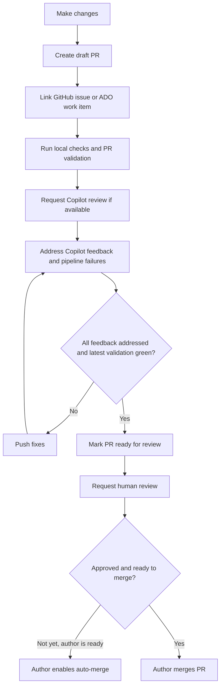

# mssql-rs PR Workflow

Follow this workflow for pull requests in `microsoft/mssql-rs`.

## Draft-first PRs

- Create pull requests in draft mode first.
- Link the related GitHub issue or Azure DevOps Board work item in the PR description.
- Fill out the PR template and keep the checklist current.
- Run the relevant local validation before marking the PR ready for review. At minimum, use the repo checklist: `cargo bfmt`, `cargo bclippy`, and `cargo btest`. Use the broader repo scripts when changes affect areas outside the main workspace.
- Request a Copilot review if that option is available.
- Address Copilot feedback before requesting human review.
- Watch PR validation pipelines and fix any failures.
- Iterate until all feedback is addressed and validation passes on the latest commit.
- Mark the PR as ready for review only after the latest commit has passing validation and the author has completed a self-review.
- Request human review after the PR is ready for review.

## Merge ownership

- The PR author owns the merge.
- Do not merge someone else's PR.
- If the author is ready for the PR to merge before required approvals or checks are complete, the author should enable auto-merge so GitHub merges it when requirements are satisfied.
- Do not ask another developer to manually merge a PR on the author's behalf.

## Workflow diagram

