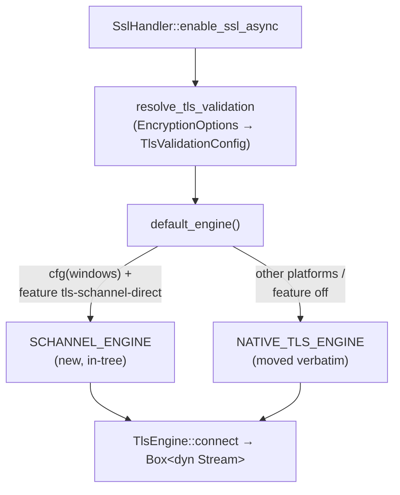
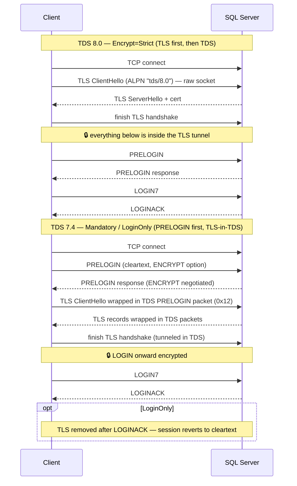
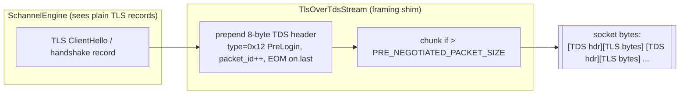
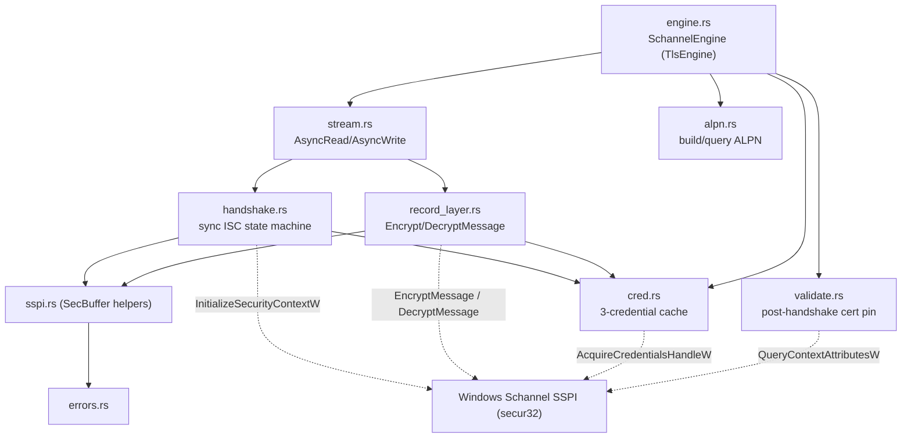
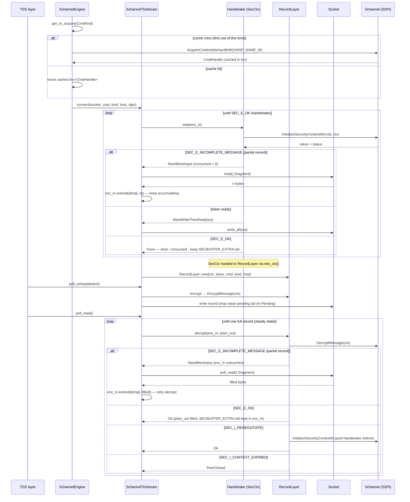
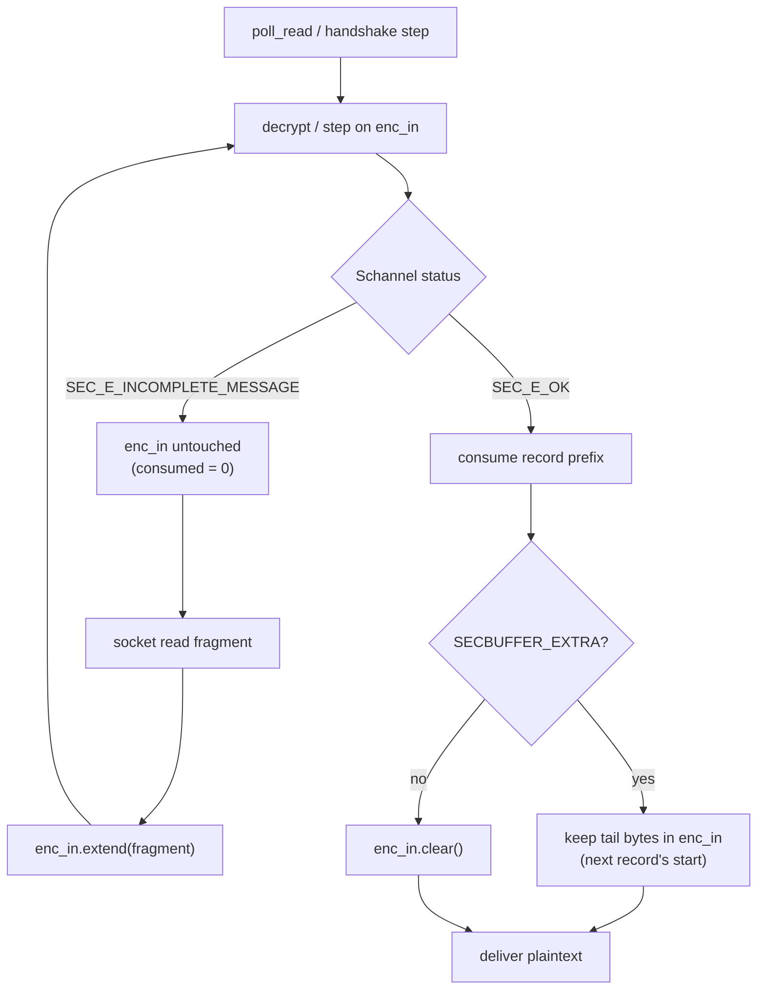

# Schannel-Direct TLS Engine — Branch Walkthrough

> Branch: `dev/saurabh/winschan-08-cutover` compared against `origin/development`
> Scope: **17 files, +2922 / −169** — the final cutover of an 8-PR stack that adds a
> Windows-only, in-tree **Schannel-direct TLS engine** to replace the
> `native-tls` / `schannel` crate path on Windows.

---

## 1. Why this branch exists — the two bugs

The Windows TLS path previously went through the `native-tls` → `schannel` crate stack.
That stack had two production-affecting defects:

1. **Cold-CAPI2 15-second stall (Adam Machanic's bulkcopy regression).**
   The upstream `schannel` crate's `validate()` *unconditionally* calls
   `CertGetCertificateChain` + `CertVerifyCertificateChainPolicy`, even when the caller
   asked to skip validation (`TrustServerCertificate=Yes`). On machines with a cold CAPI2
   cache that chain build / CTL auto-update can stall ~15s, surfacing as a bulkcopy timeout.

2. **`MidHandshakeTlsStream` waker-park race.**
   `tokio-native-tls` could park the task's waker *after* the final handshake byte had
   already arrived on the socket, hanging the connection.

The Schannel-direct engine fixes both by talking to SSPI/Schannel directly:
chain validation is opt-in per credential, and the async driver never parks a waker after
bytes have been delivered.

---

## 2. Inventory of changes

### Changed files by logical group

| Group | Files | Role |
|---|---|---|
| **Abstraction (PR #1)** | `transport/tls.rs`, `transport/tls/native_tls_engine.rs`, `ssl_handler.rs`, `transport.rs` | New `TlsEngine` trait; existing native-tls code moved verbatim behind it; `ssl_handler` now calls `default_engine().connect(...)` |
| **FFI + creds (PR #2)** | `win_tls/mod.rs`, `win_tls/sspi.rs`, `win_tls/cred.rs`, `win_tls/errors.rs` | Raw SSPI buffer helpers, 3-bucket credential cache, status→error mapping |
| **Handshake (PR #3)** | `win_tls/handshake.rs` | Sync `InitializeSecurityContextW` state machine |
| **Async wrapper (PR #4)** | `win_tls/stream.rs` | `AsyncRead` / `AsyncWrite` driver, the no-park read loop |
| **Record layer (PR #5)** | `win_tls/record_layer.rs` | `EncryptMessage` / `DecryptMessage` + TLS 1.3 `SEC_I_RENEGOTIATE` post-handshake handling |
| **Validation (PR #6)** | `win_tls/validate.rs` | Post-handshake cert-pin DER compare dispatcher |
| **Engine + cutover (PR #7/#8)** | `win_tls/engine.rs`, `win_tls/alpn.rs` | `SchannelEngine` impl, settings→`CredKind` routing, ALPN blob build/query |
| **Perf** | `benches/perf.rs`, `Cargo.toml` | `connect_only` / `fetch_large_encrypted` benches |

### Commit grouping on the branch

```
42a447b5 bench: add connect_only and fetch_large_encrypted perf targets
c9ec0ec0 win_tls: enhance credential handling for ODBC parity and performance
7e340f7c win_tls: drop SCH_CRED_MANUAL_CRED_VALIDATION from cred dwFlags
01885928 win_tls: use AcquireCredentialsHandleW for consistency
5c02ed51 win_tls: advertise TDS 8 ALPN on Encrypt=Strict handshakes
f3bcaa2e win_tls: stop duplicating SECBUFFER_EXTRA in handshake completion
41685140 win_tls: add diagnostic tracing across handshake/stream/record/cred/validate
c7477d3b winschan: hold in-flight encrypted record across partial poll_write
896f86ad winschan: fix TLS 1.3 post-handshake (SEC_I_RENEGOTIATE) + per-kind cred flags
9e71a062 winschan PR #8: cut default_engine() over to SchannelEngine on Windows
f1887bb7 winschan PR #7: SchannelEngine impl (gated on tls-schannel-direct feature)
346aee29 winschan PR #6: post-handshake validation dispatcher
8f1f7414 winschan PR #5: win_tls record layer + activate poll_read/poll_write
80d67d67 winschan PR #4: win_tls async stream wrapper (handshake driver)
7e129008 winschan PR #3: win_tls sync handshake state machine
c5f9d5ef winschan PR #2: win_tls module skeleton + 3-credential cache
45f71b6e winschan PR #1: Introduce TlsEngine trait, move native-tls behind it
```

---

## 3. The big picture — engine abstraction & dispatch

`ssl_handler` no longer knows about `native-tls`. It resolves the user's encryption options
into a `TlsValidationConfig`, builds a `TlsConnectParams`, and hands off to whichever engine
`default_engine()` selects. The native path is byte-for-byte the old code, just relocated —
so the diff there is "move, not change."



---

## 4. TDS 8.0 vs TDS 7.4 — where TLS sits in the connection flow

The Schannel-direct engine is invoked from two *different* points in the connection sequence
depending on the negotiated TDS version. This is decided in
[network_transport.rs](mssql-tds/src/connection/transport/network_transport.rs) when the
`NetworkTransport` is created:

- **TDS 8.0 (`Encrypt=Strict`)** — TLS is established **immediately on the raw TCP socket,
  before any TDS byte is exchanged** (HTTPS-style). ALPN advertises `tds/8.0`. PRELOGIN and
  LOGIN then flow *inside* the TLS tunnel. The engine wraps the socket directly.
- **TDS 7.4 (`Mandatory` / `LoginOnly` / legacy)** — the client sends an **unencrypted
  PRELOGIN first** to negotiate encryption, then the TLS handshake records are **wrapped
  inside TDS PRELOGIN packets** (`TlsOverTdsStream`). No ALPN. After the handshake, either
  the whole session is encrypted (`Mandatory`) or TLS is torn back down after LOGIN
  (`LoginOnly`, via the `ExtractableStream`).



| Aspect | TDS 8.0 (Strict) | TDS 7.4 (Mandatory / LoginOnly) |
|---|---|---|
| When TLS starts | Before any TDS packet, on raw socket | After cleartext PRELOGIN negotiation |
| TLS framing | Native TLS records on the wire | TLS records wrapped in TDS PRELOGIN packets (`0x12`) |
| ALPN | Yes — advertises `tds/8.0` (`use_alpn = true`) | No |
| `enable_ssl_async` called with | `NegotiatedEncryptionSetting::Strict` | `Mandatory` / `LoginOnly` |
| Stream wrapper | Engine wraps socket directly | `TlsOverTdsStream` → `ExtractableStream` |
| Scope of encryption | Whole session | Whole session (`Mandatory`) or login only (`LoginOnly`) |

From the engine's point of view the handshake mechanics are identical; only the underlying
byte stream differs (raw socket vs. a `TlsOverTdsStream` that frames handshake records into
TDS packets). That is why `SchannelEngine` does not need to know which TDS version is in play —
it just drives `InitializeSecurityContextW` against whatever `Box<dyn Stream>` it is handed.

### How the TLS-in-TDS framing works (TDS 7.4)

The legacy path inserts a `TlsOverTdsStream<S>`
([ssl_handler.rs](mssql-tds/src/connection/transport/ssl_handler.rs)) *between* the TLS
engine and the real socket. The TLS engine still writes/reads ordinary TLS handshake records;
this wrapper transparently adds or strips a TDS packet header around each one. It is a pure
framing shim — it never inspects or alters the TLS bytes themselves.

The wrapper has a single mode flag, `has_completed_tls_handshake`:

- **During the handshake** (`tls_handshake_starting()` sets the flag to `false`) every read and
  write is reframed into TDS PRELOGIN packets.
- **After the handshake** (`tls_handshake_completed()` sets it back to `true`) the wrapper
  becomes a pure pass-through — encrypted application records flow as native TLS records on
  the wire, exactly like TDS 8.0.

**Write path** (`poll_write_vectored`, via `ActiveWriteState`): when the engine writes a TLS
record (e.g. ClientHello), the wrapper

1. builds an 8-byte TDS header (`PacketWriter::build_header`) with `PacketType::PreLogin`
   (`0x12`) and an incrementing `packet_id`,
2. splits the TLS bytes across one or more packets if they exceed
   `PRE_NEGOTIATED_PACKET_SIZE` (each chunk ≤ `MAX_PACKET_SIZE_WITHOUT_HEADER`),
3. sets the **EOM (end-of-message) status bit** only on the packet that carries the last byte
   of the record (`current_packet_bytes_remaining == payload_bytes_remaining`),
4. writes header-then-payload to the socket, tolerating partial writes via
   `header_bytes_remaining` / `payload_bytes_remaining` bookkeeping.

**Read path** (`poll_read` → `read_requested`): when the engine asks for handshake bytes, the
wrapper

1. first reads the 8-byte TDS header (handling partial header reads with
   `bytes_of_packet_header_read`),
2. parses the payload length from header bytes `[2..4]` (big-endian) minus the header size into
   `remaining_read_packet_payload_length`,
3. then returns *only* the raw TLS payload bytes to the engine, never the TDS header, and
   continues across packet boundaries until the engine has the full record.



So on the wire during a TDS 7.4 handshake you see a sequence of `0x12` PRELOGIN packets whose
payloads, concatenated, reconstruct the raw TLS handshake stream. The SQL Server side unwraps
them symmetrically before feeding them to its own Schannel.

---

## 5. Module layering inside `win_tls`



The dotted arrows are the actual Win32 SSPI calls into the OS Schannel provider:
`handshake.rs` drives the handshake with `InitializeSecurityContextW`, `record_layer.rs`
does the steady-state `EncryptMessage`/`DecryptMessage`, `cred.rs` obtains the credential via
`AcquireCredentialsHandleW`, and `validate.rs` pulls the peer cert with
`QueryContextAttributesW`. The solid arrows are intra-crate module dependencies; `sspi.rs`
only provides the `SecBuffer` plumbing those calls use.

---

## 6. Settings → `CredKind` → SSPI parameter mapping

This ties user-facing connection-string settings all the way down to the actual Win32 flags.

| Connection setting | `TlsValidationConfig` | `CredKind` (cache bucket) | Cred `dwFlags` | Per-call ISC bit | Post-handshake validation |
|---|---|---|---|---|---|
| `TrustServerCertificate=Yes` / `LoginOnly` | `accept_invalid_certs=true` | `NoValidate` | `SCH_USE_STRONG_CRYPTO` + `NO_DEFAULT_CREDS` (+ name-check skip\*) | `ISC_REQ_MANUAL_CRED_VALIDATION` | none (the Adam fix) |
| `ServerCertificate=<path>` (pinning) | `accept_invalid_certs=true` + path | `ManualValidate` | base | `ISC_REQ_MANUAL_CRED_VALIDATION` | DER compare in `validate.rs` |
| `Encrypt=Strict` / `Mandatory` default | `accept_invalid_certs=false` | `AutoValidate` | `SCH_CRED_AUTO_CRED_VALIDATION` | *(none)* — Schannel validates inline | none (already done inline) |

\* The exact flag bits are still evolving on this branch. Commit `7e340f7c` dropped
`SCH_CRED_MANUAL_CRED_VALIDATION` from the cred `dwFlags`, and `896f86ad` introduced per-kind
flag tuning. Treat the `dwFlags` column as directional, not final.

**Key insight:** *three* credentials with otherwise-identical flags exist only because SSPI
partitions its TLS session cache by `CredHandle`. This mirrors ODBC's
`s_hClientCred` / `s_hClientCredValidate` / `s_hClientCredManualValidate`
(`SNI_SslProvider.cpp:1818-1821`).

---

## 7. Handle lifecycle & data flow



### Handle flow notes

- **`CredHandle`** — process-wide, `Arc`-shared, RAII-freed (`FreeCredentialsHandle`).
  One per `CredKind`. Lives in `cred.rs`'s `OnceLock` cache.
- **`SecCtx` (SecHandle)** — per-connection. Created during handshake, then *moved*
  (`into_ctx()`) into the `RecordLayer` so encrypt/decrypt use the exact context the
  handshake built. RAII-freed (`DeleteSecurityContext`).
- The `cred` `Arc` is deliberately kept alive *inside* `RecordLayer` too, because TLS 1.3
  post-handshake messages (`SEC_I_RENEGOTIATE`) require re-entering
  `InitializeSecurityContextW` with the original credential.

---

## 8. The two bug-fix mechanisms

### No-park read loop (`stream.rs::connect`)

Every `Ready(n)` from `socket.read().await` is followed by an **unconditional** re-entry
into `step()`. There is a single `enc_in` buffer and no `WouldBlock` shim that could trick
the driver into parking the waker after the final wire byte has arrived.

```text
loop {
    let outcome = handshake.step(&mut enc_in, &mut consumed)?;
    if consumed > 0 { enc_in.drain(..consumed); }
    match outcome {
        Done | DoneWithFlush => return Ok(...),
        WantWriteThenRead(out) => socket.write_all(&out).await?,
        NeedMoreInput => { /* fall through to read */ }
    }
    let n = socket.read(&mut tmp).await?;
    if n == 0 { return Err(unexpected EOF); }
    enc_in.extend_from_slice(&tmp[..n]);
}
```

### No inline chain build (`validate.rs`)

`validate_after_handshake` dispatches on `CredKind`:

- `NoValidate` → literal no-op (this is what avoids `CertGetCertificateChain` — the Adam fix).
- `AutoValidate` → no-op too; Schannel already validated chain + hostname inline during ISC.
- `ManualValidate` → query the remote cert DER and run the constant-time pin compare shared
  with the native-tls path.

---

## 9. Notable steady-state details

### Partial network reads — TLS record reassembly

The network delivers arbitrary byte fragments; a single TLS record can span multiple reads,
and a single read can contain bytes belonging to the *next* record. The code treats Schannel's
`SEC_E_INCOMPLETE_MESSAGE` / `SECBUFFER_EXTRA` as the framing oracle and reassembles full
records in one growable buffer (`enc_in`) before handing anything to
`DecryptMessage` / `InitializeSecurityContextW`.



The invariant that makes this safe: **`enc_in` is only ever drained by exactly the number of
bytes Schannel reports consuming — never speculatively.** Under-read → accumulate more into
the same buffer and retry; over-read → the surplus stays buffered as the next record's prefix.

| Scenario | Signal | Handling |
|---|---|---|
| Handshake record split across reads | `SEC_E_INCOMPLETE_MESSAGE` → `NeedMoreInput`, `consumed=0` | Append next read to same `enc_in`, retry `step` |
| App-data record split across reads | `SEC_E_INCOMPLETE_MESSAGE` → `Decrypted::NeedMoreInput`, `enc_in` untouched | Read more, retry `decrypt` |
| Over-read (next record's bytes arrive early) | `SECBUFFER_EXTRA` | Tail preserved in `enc_in` |
| Decrypt yields more than caller's buffer | — | Surplus buffered in `plain_out`, drained across `poll_read` calls |
| Socket accepts only part of a write | `Poll::Pending` mid-write | Tail stashed in `pending_out`, drained before next record |
| Peer closes mid-record (0-byte read, `enc_in` non-empty) | clean EOF with buffered ciphertext | `UnexpectedEof` — truncation surfaced, not masked as a graceful close |

### Other details

- **Partial `poll_write` stashing** (`c7477d3b`): if the socket accepts only part of an
  encrypted record, the unsent tail is stashed in `pending_out` and drained *before* any new
  plaintext is encrypted. Injecting a fresh TLS record into the middle of an old one would
  corrupt the stream and the peer would RST (Windows error 10054). Once the stashed record is
  fully drained, that `poll_write` returns the *plaintext* length the record represented
  (`pending_plain_len`). This relies on the caller retrying with the same buffer after the
  earlier `Poll::Pending` — exactly how `AsyncWriteExt::write_all` drives us; a `debug_assert`
  guards the invariant so a misbehaving caller can't silently get back `Ok(n > buf.len())`.
- **`SECBUFFER_EXTRA` handling** (`f3bcaa2e`): on handshake completion the `enc_in` tail is
  retained by draining only `consumed` bytes — the `extra` copy is *not* re-appended, which
  previously duplicated piggybacked bytes (e.g. a TLS 1.3 NewSessionTicket) and broke the
  first decrypt.
- **TLS 1.3 post-handshake messages** (`896f86ad`): `DecryptMessage` returning
  `SEC_I_RENEGOTIATE` is handled by feeding the `SECBUFFER_EXTRA` bytes back through
  `InitializeSecurityContextW`. NewSessionTicket completes with `SEC_E_OK` and no output
  token; KeyUpdate / true renegotiation (which would need an output token written to the
  wire) is explicitly rejected as unsupported rather than silently dropped. If the
  post-handshake record itself arrived fragmented (`SEC_E_INCOMPLETE_MESSAGE`), the bytes are
  pushed back to the front of `enc_in` and `poll_read` reports `NeedMoreInput` so it reads more
  from the wire before retrying — rather than re-decrypting the same buffered bytes.

---

## 10. Feature gating & rollout

- New module is behind `#[cfg(windows)]` and the `tls-schannel-direct` Cargo feature.
- `default_engine()` routes to `SCHANNEL_ENGINE` only on `cfg(all(windows, feature = "tls-schannel-direct"))`;
  every other configuration keeps `NATIVE_TLS_ENGINE`.
- Non-Windows builds are completely unaffected — the native-tls engine is the same code as
  before, just relocated behind the trait.
