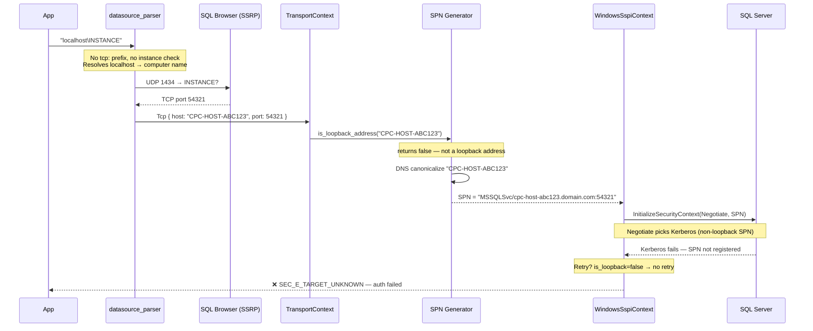
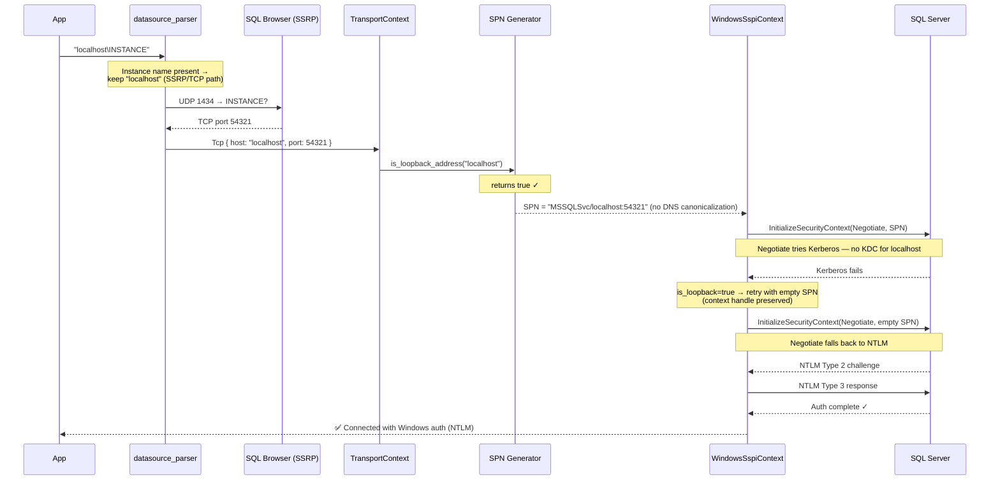

# Enhancement: SSPI Authentication for Named Instances via SSRP

## Summary

Improved SSPI (Windows Integrated) authentication when connecting to named
instances resolved through SQL Browser (SSRP). Two changes ensure the
Negotiate → NTLM authentication path works correctly for loopback and
local-machine connections.

## Changes

### 1. Preserve `localhost` for SSRP-bound connections

**File:** `mssql-tds/src/connection/datasource_parser.rs`

When a datasource like `localhost\INSTANCE` or `MACHINENAME\INSTANCE` is parsed
without an explicit protocol prefix, the server name is now kept as `localhost`
whenever the connection is local and an instance name is present. Previously, the
server name was resolved to the actual computer name (e.g. `CPC-HOST-ABC123`)
for Named Pipe / Shared Memory compatibility. Since SSRP always resolves to a
TCP port, this resolution was unnecessary for the SSRP path and had the
side-effect of defeating loopback detection during SSPI authentication.

Keeping `localhost` in the `TransportContext` ensures:

- `is_loopback_address()` returns `true`, enabling the empty-SPN NTLM fallback.
- SPN generation skips DNS canonicalization for loopback, producing
  `MSSQLSvc/localhost:<port>` which Negotiate handles via NTLM directly.
- TLS certificate hostname validation behavior is preserved.

### 2. Align SSPI loopback retry with ODBC driver behavior

**File:** `mssql-tds/src/security/windows/sspi_context.rs`

The loopback SPN retry logic in `WindowsSspiContext::generate_token()` was
updated to match the ODBC driver's (`msodbcsql`) behavior:

| Aspect | Before | After (matches ODBC) |
|---|---|---|
| **Error matching** | Only `SEC_E_TARGET_UNKNOWN` | Any SSPI failure |
| **Context handle** | Destroyed and recreated | Preserved across retry |

**Why this matters:**

- ODBC retries `InitializeSecurityContext` with an empty SPN on any failure for
  loopback connections (`sni_sspi.cpp`, `goto Retry`). The previous code only
  retried on `SEC_E_TARGET_UNKNOWN`, missing other failure codes like
  `SEC_E_NO_CREDENTIALS`.
- ODBC keeps the same context handle for the retry. Destroying the context and
  starting fresh broke the Negotiate state machine — SSPI needs the existing
  Negotiate session to renegotiate from Kerberos to NTLM within the same
  handshake.

### 3. Integration tests for SSRP with integrated auth

**File:** `mssql-tds/tests/test_ssrp_local.rs`

Added two integration tests that exercise the full SSRP + SSPI pipeline:

- `test_ssrp_named_instance_integrated_auth` — connects to
  `localhost\mssqlserver01` using Windows auth, verifies the correct instance
  is reached.
- `test_ssrp_named_instance_hostname_integrated_auth` — same test using the
  machine hostname instead of `localhost`.

Both tests require SQL Browser running and a local named instance.

## Sequence Diagrams

### Before: SSPI auth fails for named instances



### After: SSPI auth succeeds for named instances



## Authentication Flow (after changes)

```
localhost\INSTANCE
    │
    ├─ parse_server(): server_name stays "localhost" (instance present → TCP path)
    │
    ├─ SSRP: UDP 1434 → SQL Browser → resolved TCP port
    │
    ├─ TransportContext::Tcp { host: "localhost", port: <resolved> }
    │
    ├─ is_loopback_address("localhost") → true
    │
    ├─ SPN: MSSQLSvc/localhost:<port>  (no DNS canonicalization)
    │
    ├─ InitializeSecurityContext(Negotiate, SPN)
    │   → Negotiate picks NTLM (localhost SPN, no Kerberos KDC)
    │   → NTLM Type 1 → Type 2 → Type 3 → complete
    │
    └─ Connected with Windows auth ✓
```
