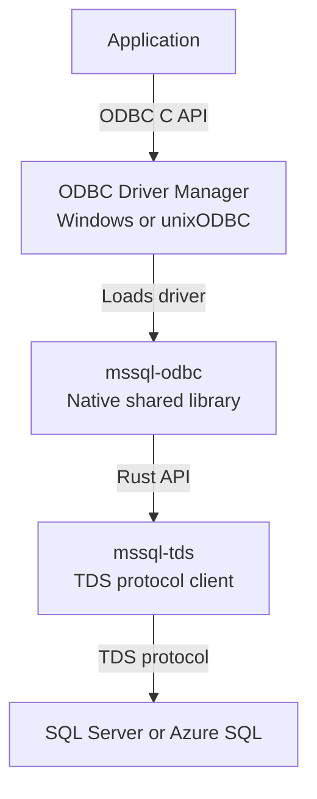

# mssql-odbc

`mssql-odbc` is a cross-platform ODBC 3.x driver for Microsoft SQL Server and
Azure SQL, written in Rust and built on [mssql-tds](../mssql-tds). It exposes
the native ODBC C API as a shared library that applications load through the
platform's ODBC Driver Manager.

> [!IMPORTANT]
> The driver is alpha software under active development. It is being validated
> as an opt-in backend for
> [mssql-python](https://github.com/microsoft/mssql-python), but it is not yet a
> complete, general-purpose replacement for Microsoft ODBC Driver 18 for SQL
> Server.

## Distribution

The driver is included in
[`mssql-python-rs`](https://pypi.org/project/mssql-python-rs/0.1.0/), the native
runtime used by `mssql-python`. Version `0.1.0` is the latest release on PyPI,
with prebuilt wheels for supported Windows, macOS, and Linux targets.

This crate is not published independently to crates.io. Build it from this
workspace when developing or testing the ODBC library directly.

## How it works



ODBC entry points cross a panic boundary, validate raw pointers in a small
unsafe layer, and delegate to safe Rust implementations. The driver targets
the behavior of Microsoft ODBC Driver 18 where practical while documenting and
testing deliberate differences.

## Platform artifacts

| Platform | Driver Manager | Library |
|---|---|---|
| Windows | Windows ODBC Driver Manager | `mssqlodbc.dll` |
| macOS | unixODBC | `mssqlodbc.dylib` |
| Linux | unixODBC | `mssqlodbc.so` |

## Build from source

Install the repository's pinned Rust toolchain. Linux and macOS builds also
need unixODBC development headers; the C++ end-to-end tests additionally need
CMake and a C++17 compiler.

From the repository root:

```bash
cargo build -p mssqlodbc
bash mssql-odbc/scripts/finalize-artifact.sh debug
```

For an optimized build, add `--release` to `cargo build` and pass `release` to
the finalization script.

On Windows, use PowerShell after building:

```powershell
cargo build -p mssqlodbc
./mssql-odbc/scripts/finalize-artifact.ps1 -BuildProfile debug
```

The finalization script prints the artifact path under the workspace Cargo
target directory.

## Test

Run the Rust test suite from the repository root:

```bash
cargo nextest run -p mssqlodbc --lib
```

The C++ end-to-end suite loads the built library through the real ODBC Driver
Manager and exercises the exported API:

```bash
bash mssql-odbc/tests/e2e/run_e2e.sh
```

On Windows, run:

```powershell
./mssql-odbc/tests/e2e/run_e2e.ps1
```

See the [end-to-end test guide](tests/e2e/README.md) for prerequisites,
connection configuration, targeted runs, coverage, and comparison testing
against `msodbcsql18`.

## Tracing

Tracing is disabled by default and is intended for diagnostics.

| Variable | Default | Purpose |
|---|---|---|
| `MSSQL_TDS_TRACE` | `false` | Set to `true` to enable tracing |
| `MSSQL_TDS_TRACE_LEVEL` | `warn` | Set a `tracing_subscriber::EnvFilter` expression |
| `MSSQL_TDS_TRACE_DIR` | unset | Write per-process trace files to this directory instead of stderr |

For example:

```bash
MSSQL_TDS_TRACE=true \
MSSQL_TDS_TRACE_LEVEL="warn,mssqlodbc=debug" \
MSSQL_TDS_TRACE_DIR="./traces" \
cargo nextest run -p mssqlodbc --lib
```

Trace events can contain sensitive data. Use a trusted directory with
appropriate permissions. Trace files are not rotated or deleted automatically.

## Contributing

Start with the repository [contribution guide](../CONTRIBUTING.md). Changes to
this crate must also follow the
[ODBC driver engineering guidelines](../.github/instructions/mssql-odbc.instructions.md),
which define the FFI safety, error handling, concurrency, parity, and testing
requirements.

Report security vulnerabilities according to the repository
[security policy](../SECURITY.md).

## License

Licensed under the [MIT License](../LICENSE).
