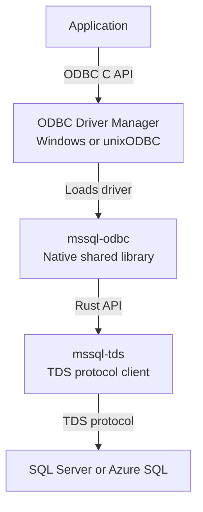

# mssql-odbc

`mssql-odbc` is a cross-platform ODBC 3.x driver for Microsoft SQL Server and
Azure SQL, written in Rust and built on [mssql-tds](../mssql-tds). It exposes
the native ODBC C API as a shared library that applications load through the
platform's ODBC Driver Manager.

> [!IMPORTANT]
> The driver is alpha software under active development. It is being validated
> as an opt-in backend for
> [mssql-python](https://github.com/microsoft/mssql-python), but it is not yet a
> complete, general-purpose replacement for Microsoft ODBC Driver 18 for SQL
> Server.

## Distribution

The driver is included in
[`mssql-python-rs`](https://pypi.org/project/mssql-python-rs/), the native
runtime used by `mssql-python`. See the PyPI release page for the current
version and available Windows, macOS, and Linux wheels.

This crate is not published independently to crates.io. Build it from this
workspace when developing or testing the ODBC library directly.

## How it works



## Platform artifacts

| Platform | Driver Manager | Library |
|---|---|---|
| Windows | Windows ODBC Driver Manager | `mssqlodbc.dll` |
| macOS | unixODBC | `mssqlodbc.dylib` |
| Linux | unixODBC | `mssqlodbc.so` |

## Build from source

Install the repository's pinned Rust toolchain. Linux and macOS builds also
need unixODBC development headers; the C++ end-to-end tests additionally need
CMake and a C++17 compiler.

From the repository root:

```bash
cargo build -p mssqlodbc
bash mssql-odbc/scripts/finalize-artifact.sh debug
```

For an optimized build, add `--release` to `cargo build` and pass `release` to
the finalization script.

On Windows, use PowerShell after building:

```powershell
cargo build -p mssqlodbc
./mssql-odbc/scripts/finalize-artifact.ps1 -BuildProfile debug
```

The finalization script prints the artifact path under the workspace Cargo
target directory.

## Test

Run the Rust test suite from the repository root:

```bash
cargo nextest run -p mssqlodbc --lib
```

### C++ end-to-end tests

The C++ end-to-end suite loads the built library through the real ODBC Driver
Manager and exercises the exported API:

```bash
bash mssql-odbc/tests/e2e/run_e2e.sh
```

On Windows, run:

```powershell
./mssql-odbc/tests/e2e/run_e2e.ps1
```

See the [end-to-end test guide](tests/e2e/README.md) for prerequisites,
connection configuration, targeted runs, coverage, and comparison testing
against `msodbcsql18`.

### Buffer safety with Miri

The `miri-odbc` nextest profile selects the opt-in `memory_safety` unit-test
modules and misalignment tests. It exercises ODBC caller-buffer handling,
including unaligned values and indicators, string bounds, fixed-width writes,
and column-wise and row-wise array address calculations. PR validation runs
this profile on Windows x64 and Linux x64.

From the repository root, with `cargo-nextest` installed:

```powershell
cargo fetch
rustup toolchain install nightly-2026-09-06 --profile minimal --component miri,rust-src
cargo +nightly-2026-09-06 miri nextest run --frozen -p mssqlodbc --lib --profile miri-odbc
```

The CI toolchain pin is `miriToolchain` in
`.pipeline/templates/validation-stages.yml`; use that value if it changes.
On Windows, set a short target directory if Miri reports that compiler response
files are unsupported:

```powershell
$env:CARGO_TARGET_DIR = Join-Path $env:TEMP "odbc-miri"
```

Run the same selection natively with:

```powershell
cargo nextest run --frozen -p mssqlodbc --lib --profile miri-odbc
```

This profile intentionally excludes handle fixtures (which start an I/O-enabled
Tokio runtime), socket-based mock servers, native authentication/TLS, and the
C++ Driver Manager tests. It complements rather than replaces native
end-to-end tests and fuzzing.

## Prepared parameter bindings

Parameter mutations compare the old and new IPD SQL definition: direction and
SQL type, character/binary SQL length, and numeric/decimal precision and scale.
Relevant changes invalidate only the owning statement's materialized plan;
unchanged definitions and records beyond its parameter markers do not.
Temporal application scales affect conversion checks, not the fixed-scale SQL
declaration; special types conservatively include their size/precision/scale.

`SQLBindParameter`, IPD `SQLSetDescField`/`SQLSetDescRec`, parameter reset, and
actual IPD refinement use this policy, including retained edits from a partially
failed setter. Descriptor locks are released before statement invalidation.
Direct IPD setters locate the owner through the DBC's statement list only when
the SQL definition changes; there is no per-execute metadata key or comparison.
The existing plan and deferred-unprepare state still travel through arrays and
data-at-execution.

This policy covers sequential mutations between completed calls. Concurrent
IPD mutation during synchronous `SQLExecute` remains a known limitation: an
edit after the binding snapshot can miss the staged plan, which execution
later restores with its old declaration. Serialize parameter edits with
execution to avoid this gap. Closing it requires coordinating the descriptor
snapshot, plan staging, and restoration; a flag set only while the plan is
absent would not cover the earlier snapshot-to-staging window. This is separate
from the Need Data restriction below, not a claim that synchronous
cross-thread calls are inherently invalid or that every Driver Manager
serializes them.

Definition changes must occur outside a data-at-execution Need Data sequence.
`SQLBindParameter` and associated `SQLSetDescField`/`SQLSetDescRec` calls in that
state are DM-enforced `HY010` errors. Keeping execution snapshots does not grant
permission to rebind or reset parameters while the sequence is parked.

Pointer-only rebinding and APD-only C type, buffer length, precision/scale, or
descriptor reassociation changes reuse the plan when the IPD SQL definition is
unchanged. Application buffers retain their existing validity requirements.
Numeric prepared declarations always use IPD precision/scale, independently of
the numeric value's wire precision/scale; the existing conversion fast path and
wire representation are preserved.

The selective policy follows msodbcsql's `ParamInfoSnapshot`/`SetIPDRec` path.
Direct IPD-field invalidation is an intentional extension: retail 18.06.0001
accepted an INTEGER-to-SMALLINT `SQLSetDescField` change but reused the old
INTEGER declaration, whereas this driver applies the new definition at the
next execute. This observation is not a measurement of retail 18.6.2.1.
The decision is recorded in the [parity registry](docs/parity-deviations.md).

## Tracing

Tracing is disabled by default and is intended for diagnostics.

| Variable | Default | Purpose |
|---|---|---|
| `MSSQL_TDS_TRACE` | `false` | Set to `true` to enable tracing |
| `MSSQL_TDS_TRACE_LEVEL` | `warn` | Set a `tracing_subscriber::EnvFilter` expression |
| `MSSQL_TDS_TRACE_DIR` | unset | Write per-process trace files to this directory instead of stderr |

For example:

```bash
MSSQL_TDS_TRACE=true \
MSSQL_TDS_TRACE_LEVEL="warn,mssqlodbc=debug" \
MSSQL_TDS_TRACE_DIR="./traces" \
cargo nextest run -p mssqlodbc --lib
```

Trace events can contain SQL text and parameter values. On Unix the driver
creates trace files with mode `0600`, and warns on stderr when
`MSSQL_TDS_TRACE_DIR` is writable by group or other users, or points inside the
system temporary directory. Configuration is captured on the first ODBC call: a
relative directory is resolved to an absolute path at that point, and the
settings cannot be changed while the driver stays loaded. Trace files are not
rotated or deleted automatically.

## Contributing

Start with the repository [contribution guide](../CONTRIBUTING.md). Changes to
this crate must also follow the
[ODBC driver engineering guidelines](../.github/instructions/mssql-odbc.instructions.md),
which define the FFI safety, error handling, concurrency, parity, and testing
requirements.

Report security vulnerabilities according to the repository
[security policy](../SECURITY.md).

## License

Licensed under the [MIT License](../LICENSE).
