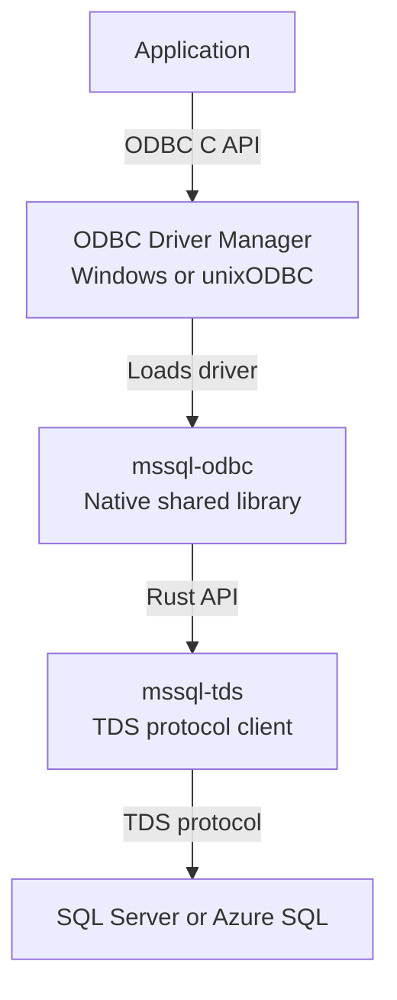

# mssql-odbc

`mssql-odbc` is a cross-platform ODBC 3.x driver for Microsoft SQL Server and
Azure SQL, written in Rust and built on [mssql-tds](../mssql-tds). It exposes
the native ODBC C API as a shared library that applications load through the
platform's ODBC Driver Manager.

> [!IMPORTANT]
> The driver is alpha software under active development. It is being validated
> as an opt-in backend for
> [mssql-python](https://github.com/microsoft/mssql-python), but it is not yet a
> complete, general-purpose replacement for Microsoft ODBC Driver 18 for SQL
> Server.

## Distribution

The driver is included in
[`mssql-python-rs`](https://pypi.org/project/mssql-python-rs/0.1.0/), the native
runtime used by `mssql-python`. Version `0.1.0` is the latest release on PyPI,
with prebuilt wheels for supported Windows, macOS, and Linux targets.

This crate is not published independently to crates.io. Build it from this
workspace when developing or testing the ODBC library directly.

## How it works



ODBC entry points cross a panic boundary, validate raw pointers in a small
unsafe layer, and delegate to safe Rust implementations. The driver targets
the behavior of Microsoft ODBC Driver 18 where practical while documenting and
testing deliberate differences.

Design notes for individual subsystems live beside the code: the parameter
binding and array-execution model in [`docs/parameters_plan.md`](docs/parameters_plan.md),
the fetch path in [`docs/typed-columnar-fetch-plan.md`](docs/typed-columnar-fetch-plan.md),
and the deliberate departures from msodbcsql in
[`docs/parity-deviations.md`](docs/parity-deviations.md).

## Platform artifacts

| Platform | Driver Manager | Library |
|---|---|---|
| Windows | Windows ODBC Driver Manager | `mssqlodbc.dll` |
| macOS | unixODBC | `mssqlodbc.dylib` |
| Linux | unixODBC | `mssqlodbc.so` |

## Build from source

Install the repository's pinned Rust toolchain. Linux and macOS builds also
need unixODBC development headers; the C++ end-to-end tests additionally need
CMake and a C++17 compiler.

From the repository root:

```bash
cargo build -p mssqlodbc
bash mssql-odbc/scripts/finalize-artifact.sh debug
```

For an optimized build, add `--release` to `cargo build` and pass `release` to
the finalization script.

On Windows, use PowerShell after building:

```powershell
cargo build -p mssqlodbc
./mssql-odbc/scripts/finalize-artifact.ps1 -BuildProfile debug
```

The finalization script prints the artifact path under the workspace Cargo
target directory.

## Test

Run the Rust test suite from the repository root:

```bash
cargo nextest run -p mssqlodbc --lib
```

### Buffer safety with Miri

The `miri-odbc` nextest profile selects the opt-in `memory_safety` unit-test
modules and the parameter reader's existing misalignment tests. They cover
unaligned values and indicators, initialized read extents, string terminators
and capacities, fixed-width writes, untouched error outputs, and reuse of caller
buffers. They also run as ordinary unit tests; no production code is replaced
under Miri. The UTF-16 reader cases check both aligned and byte-offset input,
preserving lossy decoding, explicit lengths, and NUL termination. Parameter
cases vary value, indicator, and length alignment independently, including
temporal inputs, ignored storage, and length sentinels. Column-wise arrays and
packed row-wise parameter bindings exercise production address calculations
with nonzero offsets and distinct first/last values.

The SQL NULL case with an uninitialized octet-length slot tests only
`read_indicator`'s early return, not full execution. Execution's earlier
data-at-execution probes still require readable, initialized non-null
octet-length slots for input and input/output parameters.

PR validation runs this profile under Miri on **Windows x64 and Linux x64**
only, using `nightly-2026-09-06` and seed 0. The Linux job uses the existing
Ubuntu build container. Test failures and empty selections fail the job, and
each platform publishes a separate ODBC Miri JUnit report. The ordinary native
test run still includes these tests; ARM64, macOS, and Alpine do not run Miri.
The `--package mssqlodbc` option scopes the run to the driver. The shared filter
uses only test names so it also parses in the smaller Kerberos workspace,
which omits ODBC.

The Build stage's `miriToolchain` variable in
`.pipeline/templates/validation-stages.yml` holds the CI pin; keep the local
commands below on the same version when updating it.

From the repository root, with `cargo-nextest` installed:

```powershell
cargo fetch
rustup toolchain install nightly-2026-09-06 --profile minimal --component miri,rust-src
cargo +nightly-2026-09-06 miri nextest run --frozen -p mssqlodbc --lib --profile miri-odbc
```

`cargo fetch` creates the local, gitignored lockfile and restores dependencies
before the frozen run. On Windows, a long checkout path can make Cargo use a
compiler response file, which this Miri version does not support. In that case,
set a short, dedicated build directory before running Miri:

```powershell
$env:CARGO_TARGET_DIR = Join-Path $env:TEMP "odbc-miri"
```

Run the same selection natively with:

```powershell
cargo nextest run --frozen -p mssqlodbc --lib --profile miri-odbc
```

The tests keep unread input tails uninitialized so Miri can detect over-reads
that stay inside an allocation. Output sentinels additionally catch writes
outside the declared slot even when those writes remain inside the backing
allocation. Deliberate misalignment is asserted before the call, and C struct
padding is not assumed to be initialized.

This profile intentionally excludes handle fixtures (which start an I/O-enabled
Tokio runtime), socket-based mock servers, native authentication/TLS, and the
C++ Driver Manager tests. It does not test Windows DLL unloading or replace
native end-to-end tests or fuzzing. Keep Miri's alignment and aliasing checks
enabled; a passing run covers only the inputs and executions exercised.

### C++ end-to-end tests

The C++ end-to-end suite loads the built library through the real ODBC Driver
Manager and exercises the exported API:

```bash
bash mssql-odbc/tests/e2e/run_e2e.sh
```

On Windows, run:

```powershell
./mssql-odbc/tests/e2e/run_e2e.ps1
```

See the [end-to-end test guide](tests/e2e/README.md) for prerequisites,
connection configuration, targeted runs, coverage, and comparison testing
against `msodbcsql18`.

## Typed character retrieval

`SQLGetData` converts `varchar(max)` and `nvarchar(max)` into the same supported
integer, floating-point, GUID, and date/time C targets as non-max text. It
preserves the column's encoding and any unread characters from an earlier
character read. Fixed-size targets ignore `BufferLength` and report their C
type's size after successful conversion.

Typed PLP conversion accepts at most 1 MiB of source wire data, matching bound
fetches. Larger values are drained and rejected with `HYC00`, leaving output
buffers unchanged; no truncated numeric prefix is returned. See
[deviation 7](docs/parity-deviations.md) for the measured native-driver difference.
Empty character values retrieved as numeric or GUID C targets succeed with
indicator 0 and leave the value buffer unchanged, matching msodbcsql18. Empty
date/time literals remain `22018`. SQL NULL still uses `SQL_NULL_DATA` and
requires an indicator pointer.

## Connection busy gate

`SQLFetch`/`SQLFetchScroll`/`SQLGetData` release the connection's busy claim
(`DbcState::active_stmt`) as soon as the wire is drained for the current
statement, instead of holding it for the statement's whole cursor lifetime —
matching msodbcsql's wire-state `FIsBusyReadingData` gate (see AB#47508).
This costs a one-token read-ahead on ordinary fetches: no extra round trip,
but returning row N can now wait on row N+1's header arriving. See
`release_busy_if_row_exhausted` in `src/api/exec_common.rs` for the full
trade-off and why it was accepted as-is.

## Bound fetch performance

Bound fetches borrow their per-fetch descriptor snapshot rather than copying a
binding for every cell. SQL type resolution is deferred until a binding requests
`SQL_C_DEFAULT`, and complete inline rows need no PLP metadata snapshot.
After a packet-boundary continuation, resident columns return to synchronous
decoding; network waits retain the existing cancellation and timeout handling.
Datetimeoffset conversion uses checked 64-bit arithmetic while preserving the
out-of-range rejection of the wider calculation.
Same-encoding wide delivery in bound fetches and `SQLGetData` copies complete
UTF-16 code units without decoding them. This preserves unpaired surrogates,
BOM-like units, and embedded NULs for the application's decoding policy.
Actual encoding conversions use the explicit encoding without BOM sniffing:
leading BOM-shaped bytes remain data, including in non-Unicode `varchar` values.
The materialized-value fast paths require an even byte length before
using the raw-unit copy helper. Odd-length PLP streams retain their existing
behavior and are not covered by this parity claim.
Bound buffers trim a real surrogate pair if truncation would split it, but keep
already-unpaired units. `SQLGetData` can split a pair across calls because the
caller retrieves the remaining units on its next call.

The native `GetDataUtf16Test` and `FetchScrollUtf16Test` cases reproduce these
fetch behaviors against SQL Server through the Driver Manager, comparing raw
units rather than decoded strings. `BoundTruncationPreservesOnlyCompletePairs`
checks real-server truncation; the Rust
`bound_wide_plp_preserves_units_across_wire_chunks` test additionally uses a mock
server to force a surrogate pair across a PLP chunk boundary that a SQL query
cannot control.

Bound narrow-codepage `SQL_C_CHAR` truncation converts only a buffer-sized
prefix, then drains the remaining wire bytes without conversion. For a known
length, the indicator estimates unread source bytes at 1:1 plus converted
output (including withheld characters), matching classic msodbcsql's
`sqlcdata.h` accounting before `FlushData`. Source held by a DBCS decoder stays
in the unconverted count; unknown lengths remain `SQL_NO_TOTAL`. A fitting
value reports its exact UTF-8 length. `SQLGetData` keeps its resumable behavior.

Materialized CP1252 `varchar` values delivered as `SQL_C_WCHAR` decode directly
to bounded UTF-16 scratch space, without allocating a UTF-8 string or copying
borrowed source bytes. Each CP1252 byte produces one UTF-16 unit, so repeated
`SQLGetData` calls decode only the next requested chunk and report the exact
remaining byte length. This applies to buffered/captured reads, bound row
arrays and output parameters. Other encodings, `SQL_C_CHAR`, and streaming MAX
conversion retain their existing paths.

## SQLGetData target switches

An active PLP value can change between `SQL_C_CHAR`, `SQL_C_WCHAR`, and
`SQL_C_BINARY`. Both text targets first copy any pending converted bytes
**without re-encoding them**; binary bypasses those bytes and completes when
the unread wire payload ends. This matches msodbcsql's `InternalGetColData`
(`odbc/sqlcdata.h`) and completion gate (`odbc/sqlcdata.cpp`), measured on Linux
with retail 18.6.2.1 (`SQL_DRIVER_VER` `18.06.0002`). See AB#48046.

Text conversions finish a trailing partial source character before returning,
even if earlier characters already produced output. Internal completion reads
append to that output and preserve the call's length accounting.
If malformed input starts a new character during completion, its bytes are
returned to the raw stream for the next read. Completion does not keep consuming
a chain of malformed characters after the output buffer fills.

One reference-driver quirk remains: after a narrow read exhausts an
`nvarchar(max)` value's wire bytes, a WCHAR probe with no payload room reports
`01004` with indicator **0**, even when converted carry remains. The indicator
counts only unread wire bytes on this path; callers must provide payload room
to drain the carry, rather than keep issuing zero-capacity probes.

A zero-length binary probe before text conversion consumes nothing. A consuming
binary read followed by text conversion resumes at the next unread byte, even
if that position splits a multibyte character, as in the reference driver.

## Parameter array results

Prepared parameter arrays can return rows from `SELECT`, `INSERT ... OUTPUT`,
and procedures. Fetch the current result normally and use `SQLMoreResults` to
advance through the results in parameter-set order. Completion counts and
statuses are deferred until the corresponding sets finish; inspect the final
bookkeeping after navigation reaches `SQL_NO_DATA`. Closing the cursor drains
unread results without executing any parameter set again.

`SQLGetInfo(SQL_PARAM_ARRAY_SELECTS)` reports `SQL_PAS_BATCH`. Non-row-returning
arrays still complete during `SQLExecute` and report their aggregate row count.

RPC value encoding avoids per-parameter boxed futures. Complete buffered
DONE-family and RETURNSTATUS tokens are decoded without constructing the
asynchronous parser; cancellation still uses the normal ATTENTION settlement
path, and incomplete tokens retain the existing network-read behavior.
Optional streaming declarations and encryption metadata are stored out of line
so ordinary parameter arrays do not copy their unused storage for every value.
Small RPC headers and type metadata are written together when buffered space
allows; packet-boundary writes retain normal overflow and cancellation handling.
Response-token reads skip clock sampling for unlimited query timeouts while
retaining elapsed-time accounting for finite and exhausted budgets.
Inlining hints target parameter positioning, conversion, RPC encoding, and
response/value dispatch. The large conversion and serialization functions use
`#[inline]`, leaving the final inlining decision to the compiler.

## Prepared parameter bindings

Parameter mutations compare the old and new IPD SQL definition: direction and
SQL type, character/binary SQL length, and numeric/decimal precision and scale.
Relevant changes invalidate only the owning statement's materialized plan;
unchanged definitions and records beyond its parameter markers do not.
Temporal application scales affect conversion checks, not the fixed-scale SQL
declaration; special types conservatively include their size/precision/scale.

`SQLBindParameter`, IPD `SQLSetDescField`/`SQLSetDescRec`, parameter reset, and
actual IPD refinement use this policy, including retained edits from a partially
failed setter. Descriptor locks are released before statement invalidation.
Direct IPD setters locate the owner through the DBC's statement list only when
the SQL definition changes; there is no per-execute metadata key or comparison.
The existing plan and deferred-unprepare state still travel through arrays and
data-at-execution.

This policy covers sequential mutations between completed calls. Concurrent
IPD mutation during synchronous `SQLExecute` remains a known limitation: an
edit after the binding snapshot can miss the staged plan, which execution
later restores with its old declaration. Serialize parameter edits with
execution to avoid this gap. Closing it requires coordinating the descriptor
snapshot, plan staging, and restoration; a flag set only while the plan is
absent would not cover the earlier snapshot-to-staging window. This is separate
from the Need Data restriction below, not a claim that synchronous
cross-thread calls are inherently invalid or that every Driver Manager
serializes them.

Definition changes must occur outside a data-at-execution Need Data sequence.
`SQLBindParameter` and associated `SQLSetDescField`/`SQLSetDescRec` calls in that
state are DM-enforced `HY010` errors. Keeping execution snapshots does not grant
permission to rebind or reset parameters while the sequence is parked.

Pointer-only rebinding and APD-only C type, buffer length, precision/scale, or
descriptor reassociation changes reuse the plan when the IPD SQL definition is
unchanged. Application buffers retain their existing validity requirements.
Numeric prepared declarations always use IPD precision/scale, independently of
the numeric value's wire precision/scale; the existing conversion fast path and
wire representation are preserved.

The selective policy follows msodbcsql's `ParamInfoSnapshot`/`SetIPDRec` path.
Direct IPD-field invalidation is an intentional extension: retail 18.06.0001
accepted an INTEGER-to-SMALLINT `SQLSetDescField` change but reused the old
INTEGER declaration, whereas this driver applies the new definition at the
next execute. This observation is not a measurement of retail 18.6.2.1.
The decision is recorded in the [parity registry](docs/parity-deviations.md).

## Tracing

Tracing is disabled by default and is intended for diagnostics.

| Variable | Default | Purpose |
|---|---|---|
| `MSSQL_TDS_TRACE` | `false` | Set to `true` to enable tracing |
| `MSSQL_TDS_TRACE_LEVEL` | `warn` | Set a `tracing_subscriber::EnvFilter` expression |
| `MSSQL_TDS_TRACE_DIR` | unset | Write per-process trace files to this directory instead of stderr |

For example:

```bash
MSSQL_TDS_TRACE=true \
MSSQL_TDS_TRACE_LEVEL="warn,mssqlodbc=debug" \
MSSQL_TDS_TRACE_DIR="./traces" \
cargo nextest run -p mssqlodbc --lib
```

Trace events can contain SQL text and parameter values. On Unix the driver
creates trace files with mode `0600`, and warns on stderr when
`MSSQL_TDS_TRACE_DIR` is writable by group or other users, or points inside the
system temporary directory. Configuration is captured on the first ODBC call: a
relative directory is resolved to an absolute path at that point, and the
settings cannot be changed while the driver stays loaded. Trace files are not
rotated or deleted automatically.

## Contributing

Start with the repository [contribution guide](../CONTRIBUTING.md). Changes to
this crate must also follow the
[ODBC driver engineering guidelines](../.github/instructions/mssql-odbc.instructions.md),
which define the FFI safety, error handling, concurrency, parity, and testing
requirements.

Report security vulnerabilities according to the repository
[security policy](../SECURITY.md).

## License

Licensed under the [MIT License](../LICENSE).
