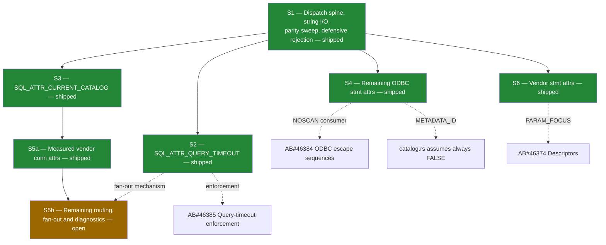

# AB#46377 — mssql-odbc | Connection & statement attributes

Proposed logical split of the work item, sized for independently shippable PRs.

**Consumer:** `microsoft/mssql-python`, replacing its in-package `msodbcsql18` with
this driver. Every slice below is justified by a call the Python layer actually
makes, or by the unfiltered pass-through surface it exposes (§4.10).

**Parity reference:** `C:\work\msodbcsql\Sql\Ntdbms\sqlncli\odbc\sqlcmisc.cpp`
(`ExportImp::SQLSetConnectAttrW` L1459, `SQLGetConnectAttrW` L2979,
`SQLSetStmtAttrW` L3508, `SQLGetStmtAttrW` L4186).

**Status:** S1–S4, S5a and S6 are shipped. S5b is the only open slice and is
tracked by AB#47526. Behavior marked *measured* below was observed by running
the same `mssql-odbc/tests/e2e/tests/attributes_test.cpp` suite against
msodbcsql18 and against this driver.

---

## 1. Scope boundary

This story owns the **attribute contract**: accept, validate, store, read back,
and reject with the right SQLSTATE. It does **not** own the downstream behavior
those attributes drive — that is already split into sibling stories.

| Concern | Owner |
|---|---|
| Accept/store/read-back `SQL_ATTR_QUERY_TIMEOUT` | **46377** (this) |
| Actually cancelling a query on timeout | AB#46385 Query-timeout enforcement |
| `SQL_ATTR_NOSCAN` accept/store | **46377** |
| `{fn}` / `{ts}` / `{call}` translation when NOSCAN is off | AB#46384 ODBC escape sequences |
| `SQL_ATTR_APP_PARAM_DESC` / `APP_ROW_DESC` as attributes | **46377** |
| Descriptor handle semantics behind them | AB#46374 Descriptors |
| `SQL_ATTR_PARAMSET_SIZE` accept/store | **46377** |
| Array-bound `executemany` execution | AB#46576 Batch insert |
| `SQL_ATTR_RESET_CONNECTION`, `SQL_ATTR_CONNECTION_DEAD` | AB#47317 (Closed) |
| `SQL_ATTR_AUTOCOMMIT`, `SQL_ATTR_TXN_ISOLATION` | AB#46379 (Closed) |
| Connection-string keyword parsing | AB#46372 (Closed) |
| `SQLGetInfo` values | AB#46381 Driver info |

---

## 2. Verified current state

Read from `mssql-odbc/src/api/{set,get}_{connect,stmt,env}_attr.rs` at
`dev/saurabh/special-fortnight`.

### Environment (§4.2.1) — complete

`SQL_ATTR_ODBC_VERSION` handled in `set_env_attr.rs`. Pooling is client-side in
mssql-python, so `SQL_ATTR_CONNECTION_POOLING` is out of scope.

### Connection (§4.2.2)

| Attribute | Set | Get | Note |
|---|---|---|---|
| `SQL_ATTR_LOGIN_TIMEOUT` | ✅ | ✅ | clamped to `0xFFFE`, `01S02` on clamp |
| `SQL_ATTR_CONNECTION_TIMEOUT` | ✅ | ✅ | |
| `SQL_ATTR_PACKET_SIZE` | ✅ | ✅ | pre-connect only |
| `SQL_ATTR_ACCESS_MODE` | ✅ | ✅ | |
| `SQL_ATTR_AUTOCOMMIT` | ✅ | ✅ | |
| `SQL_ATTR_TXN_ISOLATION` / `SQL_COPT_SS_TXN_ISOLATION` | ✅ | ✅ | |
| `SQL_ATTR_RESET_CONNECTION` / `SQL_COPT_SS_RESET_CONNECTION` | ✅ | — | |
| `SQL_ATTR_CONNECTION_DEAD` | — | ✅ | |
| `SQL_COPT_SS_ACCESS_TOKEN` | ✅ | — | pre-connect only |
| `SQL_ATTR_ANSI_APP` | ✅ no-op | ✗ `HYC00` | deliberate |
| `SQL_ATTR_QUERY_TIMEOUT` | ✅ fan-out | ✗ `HY092` | write-only on a connection |
| **`SQL_ATTR_CURRENT_CATALOG`** | ✅ | ✅ | **delivered by S3** |
| `SQL_COPT_SS_INTEGRATED_SECURITY` | ✅ | ✅ | attribute overrides keyword |
| `SQL_COPT_SS_ENCRYPT` | ✅ | ✅ | attribute overrides keyword |
| `SQL_COPT_SS_TRUST_SERVER_CERTIFICATE` | ✅ | ✅ | reports effective policy |

The remaining recognized connection attributes are pending in S5b and return
their measured not-implemented diagnostic; an unknown identifier returns `HY092`.

### Statement (§4.2.3)

| Attribute | Set | Get |
|---|---|---|
| `SQL_ATTR_CURSOR_TYPE` | ✅ | ✅ |
| `SQL_ATTR_CONCURRENCY` | ✅ | ✅ |
| `SQL_ATTR_ROW_ARRAY_SIZE` | ✅ | ✅ |
| `SQL_ATTR_ROWS_FETCHED_PTR` | ✅ | ✅ |
| `SQL_ATTR_ROW_STATUS_PTR` / `ROW_BIND_TYPE` | ✅ | ✅ |
| `SQL_ATTR_PARAMSET_SIZE` | ✅ | ✅ |
| `SQL_ATTR_APP_PARAM_DESC` / `APP_ROW_DESC` | ✅ no-op | ✅ |
| `SQL_ATTR_IMP_ROW_DESC` / `IMP_PARAM_DESC` | — | ✅ |
| `SQL_ATTR_MAX_ROWS` | ✅ enforced | ✅ |
| `SQL_ATTR_MAX_LENGTH`, `NOSCAN`, `RETRIEVE_DATA`, `USE_BOOKMARKS` | ✅ | ✅ |
| `SQL_ATTR_PARAM_BIND_OFFSET_PTR` | ✅ enforced | ✅ |
| `SQL_ATTR_PARAM_BIND_TYPE`, `PARAM_STATUS_PTR`, `PARAMS_PROCESSED_PTR`, `ROW_BIND_OFFSET_PTR` | ✅ stored | ✅ |
| `SQL_ATTR_METADATA_ID` | ✅ stored | ✅ | catalog effect pending S5b |
| **`SQL_ATTR_QUERY_TIMEOUT`** | ✅ | ✅ | **delivered by S2** |
| `SQL_SOPT_SS_*` 1225–1238 | measured per id | measured per id | **delivered by S6** |

Unknown identifiers return `HY092`; recognized optional behavior that is not
implemented returns `HYC00`.

---

## 3. Findings that shape the split

**F1 — `SQL_ATTR_QUERY_TIMEOUT` hard-fails.** `set_stmt_attr.rs:205` rejects it
with `HY092`. `mssql_python/cursor.py::_set_timeout` calls
`DDBCSQLSetStmtAttr(hstmt, SQL_ATTR_QUERY_TIMEOUT, ...)` whenever
`timeout > 0`, both at cursor creation and again in `executemany`. Python
swallows the error (`logger.warning`), so the symptom is a **silently ignored
timeout**, not a crash — worse than a hard failure. `execute.rs:101` confirms
nothing is wired.

**F2 — `SQL_ATTR_CURRENT_CATALOG` is unimplemented, and there is no string-output
path at all.** `sql_get_connect_attr_w_safe` took `_buffer_length` and
`_string_length_ptr` as *unused* parameters; every branch wrote a fixed-width
integer. Any character-typed connection attribute needs that plumbing first
(length negotiation, `01004` truncation, `SQL_NTS`). **Resolved:** `util.rs` now
carries `read_utf16_attr` / `write_wide_attr`, both with byte-count semantics.

**F3 — Unknown-attribute SQLSTATE is inconsistent and diverges from msodbcsql.**
`SQLSetConnectAttrW` returned `HYC00`; `SQLSetStmtAttrW` returns `HY092`.
msodbcsql's stmt path ends in `IDS_S1_092` (= `HY092`, `sqlcmisc.cpp:4177`), but
its **connect path does not have a rejecting default at all** — `sqlcmisc.cpp:2879`
falls through to `IsSetStmtOptionValid(...)` and, when the identifier is a valid
*statement* option, **fans it out to every statement on the connection**. That is
the ODBC "set a statement attribute through the connection handle" contract, and
this driver does not implement it generally. mssql-python's `attrs_before` is
applied unfiltered, so a caller can reach it. **Partly resolved:** both connect
catch-alls now return `HY092`, and the fan-out exists for `QUERY_TIMEOUT` only;
the general mechanism stays in S5b.

> Note when reading the tests: id `1234` is a real undocumented `SQL_COPT_SS_*`
> identifier that msodbcsql accepts, so "unknown attribute" tests must use
> something outside the vendor range (`99999`).

**F4 — §4.10 pass-through is the real risk surface.** `attrs_before` accepts any
`int` key with an `int`/`str`/`bytes` value and applies it unfiltered before
connect. The requirement is *never crash, always a clean SQLSTATE* — that is a
property of the dispatch layer, testable exhaustively, and worth landing before
any individual attribute.

**F5 — Vendor attributes overlap already-shipped connection-string work.** AB#46372
closed the keyword parser. `SQL_COPT_SS_ENCRYPT`, `TRUST_SERVER_CERTIFICATE`,
`APPLICATION_INTENT`, `AUTHENTICATION`, `MULTISUBNET_FAILOVER`, `TNIR`,
`CONNECT_RETRY_*`, `SERVER_SPN`, `FAILOVER_PARTNER*`, `ATTACHDBFILENAME` are the
*attribute spellings of keywords the parser already understands*. The incremental
work is routing, not semantics — which makes them one cheap batch, not N stories.

---

## 4. Proposed split

Six original subtasks, with S5 later split into S5a/S5b. **S1–S3 are the
mssql-python cutover blockers**; S4, S5a/S5b and S6 are parity completeness.

---

### S1 — Attribute dispatch spine, string I/O, and defensive rejection — **delivered**

> `mssql-odbc | Attribute dispatch & pass-through hardening` (AB#47453)

**Why first:** every other slice needs the table, the string plumbing, and the
rejection policy. Alone it discharges the §4.10 "never crash on unexpected input"
requirement.

**Landed with S2/S3** (the parts those two could not proceed without):

- Character-attribute I/O in `util.rs`: `read_utf16_attr` (byte-count input,
  `SQL_NTS` passthrough) and `write_wide_attr` (honors `buffer_length`, writes
  `string_length_ptr`, returns `01004` + `SQL_SUCCESS_WITH_INFO` on truncation,
  treats a null `value_ptr` as a length query).
- `SQLGetConnectAttrW`'s `buffer_length` / `string_length_ptr` are real
  parameters instead of unused placeholders.
- Both connect-attribute catch-alls return `HY092` instead of `HYC00` (F3).
- `post_tds_error_as` in `sqlstate.rs`, for paths where msodbcsql forces a
  SQLSTATE over the error-number map.

**Landed here**

- **The msodbcsql truth table, measured rather than guessed.** A ctypes sweep
  drove 135 attribute identifiers through `SQLSetConnectAttrW` /
  `SQLGetConnectAttrW` / `SQLSetStmtAttrW` / `SQLGetStmtAttrW` on a live
  msodbcsql 18, pre- and post-connect, recording
  `(scope, phase, op, id) → (SQLRETURN, SQLSTATE)`. 321 units, 513 rows. See §8
  for how to reproduce it.
- `src/api/attributes.rs`, generated from that CSV: `DBC_ATTRS` (90 ids) and
  `STMT_ATTRS` (46 ids), each row carrying an `OP_SET` / `OP_GET` flag mask.
  `native_attr_name(scope, op, id)` answers "does msodbcsql know this
  identifier, in this scope, on this operation?"; `unimplemented_attr_diag`
  turns that into the right `DiagMsg`.
- All four attribute catch-alls now consult it: **recognized → `HYC00`**
  (not implemented), **unrecognized → `HY092`** (not an attribute). A caller
  probing for, say, MARS can now tell "unavailable" from "no such thing"
  instead of getting one undifferentiated error.
- Property test sweeping the identifier space (boundaries plus stride 7 across
  0–12000, both scopes, both operations) asserting classification never panics.
- e2e Variations 23–30 in `attributes_test.cpp`. 23–27 are pure parity and pass
  unmodified on both drivers; 28–30 assert behavior that is deliberately ours.

**Two findings that shaped the design** — both measured, neither obvious:

1. **Recognition is scope-keyed.** The vendor ranges collide.
   `SQL_COPT_SS_*` and `SQL_SOPT_SS_*` both occupy 1225–1238, so
   `SQL_COPT_SS_FAILOVER_PARTNER` and `SQL_SOPT_SS_TEXTPTR_LOGGING` are both
   1225; `SQL_ATTR_OUTPUT_NTS` (env) and `SQL_ATTR_AUTO_IPD` (dbc) are both
   10001. A flat id → name map answers for the wrong scope.
2. **Recognition is *also* operation-keyed.** msodbcsql accepts the ODBC 2.x
   statement options (ids 0–12, 29) on a **connection** handle and fans them out
   to every statement (`sqlcmisc.cpp:2879`), but `SQLGetConnectAttrW` returns
   `HY092` for those same ids:

   ```
   post_connect set SQL_ATTR_QUERY_TIMEOUT -> SUCCESS_WITH_INFO 01S02
   post_connect get SQL_ATTR_QUERY_TIMEOUT -> SQL_ERROR         HY092
   ```

   A scope-only table would have softened
   `SQLGetConnectAttrW(SQL_ATTR_QUERY_TIMEOUT)` from `HY092` to `HYC00` and
   broken the contract S2 already shipped. Hence the per-operation flag column.

**Three further measured facts, recorded so nobody re-derives them:**

- **Pre-connect `SQLSetConnectAttrW` returns `SUCCESS` for every identifier**,
  including garbage — the Driver Manager buffers the call and replays it after
  connect, so the driver never sees it. Pre-connect rows prove nothing about the
  driver and are excluded from the table.
- **Environment attributes (200–202) answer `HY092` on both dbc and stmt.** The
  DM handles them; they are absent from both tables by construction.
- **Three identifiers hard-fault msodbcsql** when handed a plain 256-byte
  buffer on the connection set path: `SQL_ATTR_ENLIST_IN_DTC` (1207),
  `SQL_COPT_SS_ENLIST_IN_DTC` (1207) and `SQL_COPT_SS_CEKEYSTOREDATA` (1252).
  They dereference the pointer as a struct with no validation. Routing
  unimplemented identifiers through a table lookup rather than a pointer read
  is what makes this driver immune; Variation 31 pins that down.
- **The fault hides the get side of those ids**, which had to be measured
  separately (§8.1 step 5). The two are not alike: 1252 answers `HY010` on get,
  so it is recognized for both operations, while 1207 answers `HY092` and is
  genuinely set-only. Variation 32 asserts the 1252 get path on both drivers.

**Deferred to the slice that implements each attribute:** the value-kind and
phase columns (`int` / `pointer` / `wide string`; pre-connect / post-connect /
either). Recognition is the part every other slice needs, and the hand-written
`match` arms remain the place a *supported* attribute is defined — the table
sits behind the catch-all, so S4–S6 shrink it as they land rather than rewriting
it.

**Acceptance:** met. No input to `SQLSet/GetConnectAttrW` or
`SQLSet/GetStmtAttrW` panics or returns `SQL_ERROR` without a retrievable
`SQLGetDiagRec`; parity sweep green on both drivers; string round-trip covered
by unit + e2e tests.

**Size:** M–L. **Depends on:** nothing.

---

### S2 — `SQL_ATTR_QUERY_TIMEOUT` — **delivered**

> `mssql-odbc | SQL_ATTR_QUERY_TIMEOUT attribute contract`

**Why second:** highest-frequency consumer path that is silently broken today (F1).

**Measured msodbcsql18 behavior** (id 0), now matched:

| Probe | msodbcsql18 |
|---|---|
| statement default | `0` |
| `SQLSetStmtAttrW(30)` then get | `30` |
| `SQLSetStmtAttrW(0xFFFE)` | `SQL_SUCCESS`, no warning |
| `SQLSetStmtAttrW(0x10000)` | `SQL_SUCCESS_WITH_INFO` + `01S02`, reads back `0xFFFE` |
| `SQLSetConnectAttrW(...)` | `SQL_SUCCESS`; applied to statements already open |
| statement allocated afterwards | inherits the connection value |
| `SQLGetConnectAttrW(...)` | **`HY092`** — write-only on the connection |

**Scope**
- Accept on `SQLSetStmtAttrW`, store on `StmtHandle` state, read back on
  `SQLGetStmtAttrW`. Default `0` (no timeout).
- Validate and clamp to msodbcsql's `MAX_QUERY_TIMEOUT` (`0xFFFE`), reusing the
  existing clamp + `01S02` pattern from `set_connect_attr.rs:28`
  (`sqlcmisc.cpp:3988-3994`).
- Connection-handle route: `SQLSetConnectAttr(SQL_ATTR_QUERY_TIMEOUT)` sets the
  default for statements on that connection and fans out to the ones already
  open (`sqlcmisc.cpp:2879-2935`). The fan-out is deliberately implemented only
  for this attribute; the general mechanism stays in S5b.
- Inheritance: a statement allocated after the connection default is set picks
  it up (`sqlcfunc.cpp:173`); an explicit per-statement set overrides.
- `SQLGetConnectAttrW` deliberately has **no** arm, so it falls through to
  `HY092` exactly as msodbcsql does (`sqlcmisc.cpp:4378`).

**Explicitly out of scope:** enforcing the timeout (cancel/abort on expiry) —
AB#46385. This is a **known, deliberate divergence**: msodbcsql returns `HYT00`
after N seconds on a long query, this driver runs the query to completion. No
e2e test asserts enforcement, so the parity suite stays green either way.

**Acceptance:** `cursor.timeout = N` in mssql-python stops logging
"Failed to set query timeout"; value round-trips through get; clamp + `01S02`
matches msodbcsql.

**Size:** S–M. **Depends on:** S1 (table, SQLSTATE policy).

---

### S3 — `SQL_ATTR_CURRENT_CATALOG` — **delivered**

> `mssql-odbc | SQL_ATTR_CURRENT_CATALOG`

**Why third:** the only remaining §4.2.2 attribute, and it is on mssql-python's
`validate_attribute_value` allowlist — i.e. reachable from the *public*
`Connection.setattr` API, not just `attrs_before`.

**Measured msodbcsql18 behavior** (id 109), now matched:

| Probe | msodbcsql18 |
|---|---|
| get after connect | the database the session is actually in |
| set to a different database | `SQL_SUCCESS_WITH_INFO`, info `01000` native **5701** |
| set to the same name, different case | `SQL_SUCCESS`, **no round trip** |
| set to `(Default)` | `SQL_SUCCESS`, no-op |
| set to a nonexistent database | `HY024` + native **911**, catalog unchanged |
| set to `""` | `HY024` |
| set to > 128 UTF-16 units | `HY024` |
| `StringLength = -7` | `HY090` |
| plain `USE other_db` in user SQL | attribute follows it (live `ENVCHANGE`) |
| get into a short buffer | `01004`, `*StringLength` = **full** byte length |
| get with a null buffer | length query |
| set while a cursor is open | **`24000`**, rejected outright |
| set inside a transaction | succeeds, `@@TRANCOUNT` preserved |
| set to `tempdb]; DROP …` | stays one identifier |

Two details worth calling out because they are not derivable from the ODBC spec:

- **`HY024` overrides the error-number map.** Server error 911 normally maps to
  `08004`, and this driver's `SERVER_ERROR_TO_SQL_STATE_MAP` agrees. But
  `sqlcmisc.cpp:1873-1875` forces `IDS_HY_024` whenever the failure came from the
  server, so the catalog path needs `post_tds_error_as` to override the lookup.
- **`StringLength` is a byte count, not a character count.** The Driver Manager
  resolves `SQL_NTS` to bytes before the driver sees it. Reading it as UTF-16
  units appends whatever follows the terminator, and the server rejects the
  result with native 1055 ("invalid name … contains a NULL character"). Hence
  `read_utf16_attr`.

**Scope**
- **Set pre-connect:** seeds the login packet's database. The connection string's
  `Database=` keyword still wins if both are supplied, matching msodbcsql, which
  overwrites `conninfo.DataBase` while parsing keywords.
- **Set post-connect:** emits `USE [<db>]` with `]` doubled for quoting
  (`sqlcfunc.cpp:1933-1972` always bracket-quotes). A transaction stays open
  across the switch; an **open cursor is rejected with `24000`** rather than
  closed.
- **Get:** returns the *live* database, tracked from the TDS `ENVCHANGE` token
  (so a server-side `USE` or a failover-induced change is reflected), falling
  back to the pre-connect value. Uses the S1 string-output path.
- Interaction with `SQL_ATTR_RESET_CONNECTION` on pool check-in: confirm the
  catalog resets with the session.

**Acceptance:** set/get round-trip pre- and post-connect; buffer-truncation
returns `01004`; e2e parity against msodbcsql including the open-cursor `24000`
rejection and the `HY024`/native-911 mapping for a nonexistent database.

**Size:** M. **Depends on:** S1 (string I/O).

---

### S4 — Remaining ODBC-standard statement attributes — **shipped**

> `mssql-odbc | Remaining ODBC statement attributes` (AB#47456)

**Scope** — for each, either honor it or answer with msodbcsql's exact SQLSTATE;
no silent success. Derived from `sqlcmisc.cpp:3508` case labels minus what already
works and minus S2:

`SQL_ATTR_MAX_ROWS`, `SQL_ATTR_MAX_LENGTH`, `SQL_ATTR_NOSCAN`,
`SQL_ATTR_RETRIEVE_DATA`, `SQL_ATTR_METADATA_ID`, `SQL_ATTR_CURSOR_SCROLLABLE`,
`SQL_ATTR_CURSOR_SENSITIVITY`, `SQL_ATTR_ENABLE_AUTO_IPD`,
`SQL_ATTR_USE_BOOKMARKS`, `SQL_ATTR_FETCH_BOOKMARK_PTR`, `SQL_ATTR_KEYSET_SIZE`,
`SQL_ATTR_SIMULATE_CURSOR`, `SQL_ATTR_ASYNC_ENABLE`,
`SQL_ATTR_PARAM_OPERATION_PTR`, `SQL_ATTR_ROW_OPERATION_PTR`,
`SQL_ATTR_PARAM_BIND_OFFSET_PTR`, `SQL_ROWSET_SIZE`, plus get-only
`SQL_ATTR_ROW_NUMBER`.

Also closes the asymmetry where four attributes accept a set but reject the get
(`PARAM_BIND_TYPE`, `PARAM_STATUS_PTR`, `PARAMS_PROCESSED_PTR`,
`ROW_BIND_OFFSET_PTR`) — an app that writes then reads previously got `HY092`.

#### Measured contract

Every row was measured against msodbcsql 18 with the §8 sweep plus targeted
value probes; none of it was read out of `sqlext.h`, which documents the ODBC
ideal rather than what this driver does.

| id | attribute | default | behavior |
|---|---|---|---|
| 1 | `MAX_ROWS` | 0 | **enforced**: bounds each result set; 0 is unlimited |
| 2 | `NOSCAN` | 0 | stored, round-trips |
| 3 | `MAX_LENGTH` | 0 | 0 and 8000 → success; any other non-zero → `01S02` and the stored value is substituted with 8000 |
| 4 | `ASYNC_ENABLE` | 0 | stored |
| 8 | `KEYSET_SIZE` | 0 | 0 → success; non-zero → `01S02`, stays 0 |
| 9 | `SQL_ROWSET_SIZE` | 1 | stored, **independent of `ROW_ARRAY_SIZE`** |
| 10 | `SIMULATE_CURSOR` | `SQL_SC_UNIQUE` | only unique; otherwise `01S02`, unchanged |
| 11 | `RETRIEVE_DATA` | `SQL_RD_ON` | stored |
| 12 | `USE_BOOKMARKS` | 0 | stored |
| 14 | `ROW_NUMBER` | — | get-only; `24000` unless positioned on a row, else 0 |
| 15 | `ENABLE_AUTO_IPD` | 0 | stored |
| 17 | `PARAM_BIND_OFFSET_PTR` | 0 (null) | **enforced**: dereferenced at execute and added to both bound pointers |
| 16, 18–21, 23–24 | bind/offset/status pointers | 0 | stored |
| 22 | `PARAMSET_SIZE` | 1 | 1 → success; above 1 → `HYC00` (array binding is a deferred feature) |
| 10014 | `METADATA_ID` | 0 | stored |
| -1 | `CURSOR_SCROLLABLE` | `SQL_NONSCROLLABLE` | the boolean face of `CURSOR_TYPE` |
| -2 | `CURSOR_SENSITIVITY` | `SQL_INSENSITIVE` | `SQL_UNSPECIFIED` normalises to insensitive, silently |

Four findings changed the implementation:

- **The `MAX_ROWS` cutoff has to invalidate the row stream, not just return
  `SQL_NO_DATA`.** Measured on msodbcsql, stopping at the cap leaves the cursor
  in exactly the state it reaches at the natural end of a result set:
  `SQL_ATTR_ROW_NUMBER` and `SQLGetData` both answer `24000`. Short-circuiting
  the fetch before the row stream is reset would keep the previous row readable
  past `SQL_NO_DATA`, so an application that loops on `SQLFetch` and then reads
  columns would see one phantom row here and none on msodbcsql.
- **`SQL_ATTR_ROW_NUMBER` is not unconditionally 0.** An earlier probe only read
  it mid-fetch and saw 0. A full cursor-lifecycle probe showed `24000` with no
  cursor, `24000` after execute but before the first fetch, 0 while positioned,
  and `24000` again once the cursor is exhausted or closed. Returning a flat 0
  would make "no cursor" indistinguishable from a real position.
- **Four defaults are not 0** (`SQL_ROWSET_SIZE`, `SIMULATE_CURSOR`,
  `RETRIEVE_DATA`, `CURSOR_SENSITIVITY`). An application that reads an attribute
  to decide whether to change it takes a different branch on a driver that
  answers a blanket 0.
- **`HY024` on out-of-range values comes from the Driver Manager, not the
  driver.** The DM range-checks the documented booleans and enums before
  dispatch, so a driver-side rejection for those values is unreachable. Range
  validation is therefore deliberately absent; the identifiers themselves do
  reach the driver, which is also how `CURSOR_SCROLLABLE` is shown to alias
  `CURSOR_TYPE` driver-side.
- **`MAX_ROWS` bounds catalog result sets too.** Measured: with the cap at 2,
  `SQLTables`, `SQLColumns` and `SQLGetTypeInfo` all return exactly 2 rows on
  msodbcsql. Because catalog functions run through `finish_execute` and then the
  same `SQLFetch` path, this driver matches without special-casing — the shared
  path is the correct implementation, not an accident.
- **`PARAM_BIND_OFFSET_PTR` is honored, not inert.** msodbcsql dereferences the
  pointer at execute and adds the byte offset to the bound value pointer *and*
  the length/indicator pointer. Storing it without applying it would accept the
  set and then read the wrong application buffer, which is worse than rejecting
  it: an offset binding would silently send the wrong parameter value. The
  offset is read once per execution, so an application can walk a buffer by
  writing one `SQLLEN` between executes.

**Known divergence:** `SQL_ATTR_CURSOR_SCROLLABLE = SQL_SCROLLABLE` succeeds on
msodbcsql and reports `01S02` here, because scrollable cursors are a deferred
feature. It is the same single divergence already recorded for
`SQL_ATTR_CURSOR_TYPE`, since the two are one setting. Variation 40 asserts the
shared invariant on both drivers and the per-driver state separately.

**Cross-story notes:** `SQL_ATTR_NOSCAN` is now readable for AB#46384.
`SQL_ATTR_METADATA_ID` is stored and round-trips, but catalog dispatch still
forces pattern mode. Accepting `SQL_TRUE` without honoring identifier semantics
is a known temporary divergence; S5b must either wire it into catalog matching or
return `HYC00` until that behavior exists.

**Size:** M. **Depends on:** S1.

---

### S5a — Vendor connection attributes that route to a keyword — **shipped**

> `mssql-odbc | Vendor connection attributes & attrs_before parity` (AB#47457)

**Scope:** the three vendor connection attributes whose behaviour was measured
end to end against msodbcsql, routed to the same setting the equivalent
connection-string keyword drives.

| id | attribute | keyword it duplicates |
|---|---|---|
| 1203 | `SQL_COPT_SS_INTEGRATED_SECURITY` | `Trusted_Connection` |
| 1223 | `SQL_COPT_SS_ENCRYPT` | `Encrypt` |
| 1228 | `SQL_COPT_SS_TRUST_SERVER_CERTIFICATE` | `TrustServerCertificate` |

**Measured contract** (probes + e2e variations 59–62, both drivers):

- **Precedence is per-attribute, not one global rule.** For all three of the
  above the *attribute wins* over the keyword — `1228 = 0` overrides
  `TrustServerCertificate=yes` hard enough to fail the handshake with `08001`.
  This is the opposite of `SQL_ATTR_CURRENT_CATALOG` (109), where the `Database=`
  keyword wins and the attribute is only a fallback (S3). So the rule has to be
  established per id, not inherited.
- **Values are normalized, not range-checked.** `SQL_COPT_SS_ENCRYPT` takes
  `0` off / `1` on / `2` TDS 8.0 strict, but out-of-range input is *folded*
  rather than rejected: set `7` and the connection comes up encrypted and a
  later get returns `1`. No `HY024`. Strict is identifiable because it stops
  honoring `TrustServerCertificate`, so `2` fails a self-signed handshake that
  `1` accepts.
- **Post-connect set is rejected** with `HY011`.
- **The get reports the effective connection setting, not the stored input.**
  With no attribute ever set, `Encrypt=no` reads back `0` and an encrypted
  connection reads back `1` — the value is sourced from the keyword when the
  attribute was never used. And `Encrypt=no;TrustServerCertificate=Yes` reads
  the trust flag back as **`0`**: with encryption off there is no certificate in
  play, so the flag reports the resolved state rather than echoing the keyword.
  That last one was found by the parity e2e failing, not by a probe.

**Implementation note:** `encryption_setting()` in `driver_connect.rs` is the
single source of truth shared by the mssql-tds `EncryptionOptions` builder and
the value reported back through `SQLGetConnectAttr`, pinned by a unit test, so
the two cannot drift.

**Deliberately not routed:** `APPLICATION_INTENT`, `MULTISUBNET_FAILOVER`,
`CONNECT_RETRY_COUNT`/`_INTERVAL`, `SERVER_SPN`, `AUTHENTICATION` and the rest of
the vendor band have S1 sweep return codes but no *confirmed routing*. They are
left to S5b rather than wired up on the assumption that they behave like the
three above — which the `CURRENT_CATALOG` contrast shows is not safe.

**Size:** M. **Depends on:** S1, S3.

---

### S5b — Connection attributes: remaining routing, fan-out, and diagnostics

> follow-up to AB#47457

**Scope**
- **Route the remaining keyword-equivalent attributes (F5)**, each one measured
  first: `AUTHENTICATION`, `APPLICATION_INTENT`, `MULTISUBNET_FAILOVER`, `TNIR`,
  `CONNECT_RETRY_COUNT`, `CONNECT_RETRY_INTERVAL`, `SERVER_SPN`,
  `FAILOVER_PARTNER`, `FAILOVER_PARTNER_SPN`, `ATTACHDBFILENAME`, `OLDPWD`.
- **Read-only/diagnostic:** `SQL_COPT_SS_CLIENT_CONNECTION_ID`, `SQL_COPT_SS_SPID`,
  `SQL_COPT_SS_USER_DATA`.
- **Standard leftovers:** `SQL_ATTR_METADATA_ID` (stored today, but catalog
  dispatch still forces pattern mode), `SQL_ATTR_ASYNC_ENABLE`, `SQL_ATTR_AUTO_IPD`,
  `SQL_ATTR_TRANSLATE_LIB`, `SQL_ATTR_TRANSLATE_OPTION`.
- **Implement the statement-option fan-out (F3)** so an unrecognized connection
  attribute that is a valid statement option propagates to the connection's
  statements, as msodbcsql does at `sqlcmisc.cpp:2879` — generalizing the
  `set_query_timeout` walk that already exists.
- **Deferred, but cleanly rejected** with the SQLSTATE msodbcsql uses (not a
  generic `HYC00` if msodbcsql differs): MARS (`SQL_COPT_SS_MARS_ENABLED`),
  Always Encrypted (`COLUMN_ENCRYPTION`, `CEKEYSTOREPROVIDER`, `CEKEYSTOREDATA`,
  `CEKCACHETTL`, `TRUSTEDCMKPATHS`), DTC/XA enlistment, BCP, perf counters,
  browse-connect, `SQL_COPT_SS_QUOTED_IDENT` / `ANSI_NPW` / `CONCAT_NULL`.

**Acceptance:** every id in `sqlcmisc.cpp`'s connect switch is either honored or
returns the same `(SQLRETURN, SQLSTATE)` as msodbcsql under the S1 parity sweep;
an `attrs_before` dict mixing supported, deferred, and garbage keys behaves
identically to msodbcsql.

**Size:** L. **Depends on:** S5a.

---

### S6 — Vendor statement attributes (`SQL_SOPT_SS_*`) — **shipped**

> `mssql-odbc | Vendor statement attributes` (AB#47458)

**Scope:** the fourteen driver-private statement attributes in 1225–1238. These
are below the Driver Manager's knowledge, so unlike S4 the DM neither
range-checks values nor answers on the driver's behalf: every byte of the
contract below is the driver's own.

#### Measured contract

Measured against msodbcsql 18 with the §8 sweep plus five targeted probe
suites; none of it came from `msodbcsql.h`.

| id | attribute | shape | default | set behavior |
|---|---|---|---|---|
| 1225 | `TEXTPTR_LOGGING` | int | **1** | `{0,1}`, else `HY024` |
| 1226 | `CURRENT_COMMAND` | int | 0 | **get-only** → `HY092` |
| 1227 | `HIDDEN_COLUMNS` | int | 0 | `{0,1}` |
| 1228 | `NOBROWSETABLE` | int | 0 | `{0,1}` |
| 1229 | `REGIONALIZE` | int | 0 | `{0,1}` |
| 1230 | `CURSOR_OPTIONS` | int | 0 | range `0..=7` (3-bit mask) |
| 1231 | `NOCOUNT_STATUS` | int | **1** | **get-only** → `HY092` |
| 1232 | `DEFER_PREPARE` | int | **1** | `{0,1}` |
| 1233 | `QUERYNOTIFICATION_TIMEOUT` | int | **432000** | `1..=i32::MAX` — **0 is rejected** |
| 1234 | `QUERYNOTIFICATION_MSGTEXT` | **string** | `""` | any string; `StringLength` ≥ 0 or `SQL_NTS` |
| 1235 | `QUERYNOTIFICATION_OPTIONS` | **string** | `""` | any string; `StringLength` ≥ 0 or `SQL_NTS` |
| 1236 | `PARAM_FOCUS` | int | 0 | **always `HY024`** |
| 1237 | `NAME_SCOPE` | int | 0 | range `0..=3` |
| 1238 | `COLUMN_ENCRYPTION` | int | 0 | **always `HY024`** |

A rejected set leaves the previous value in place. `PARAM_FOCUS` and
`COLUMN_ENCRYPTION` reject *every* value including 0 — `COLUMN_ENCRYPTION` does
so even on a connection opened with `ColumnEncryption=Enabled`, so the rejection
is unconditional rather than a licence check. The QN timeout ceiling is
`i32::MAX`, not the full `SQLULEN` width the pointer slot can carry on a 64-bit
build: 2147483647 succeeds, 2147483648 and above are `HY024`.

Seven findings changed the implementation:

- **Value rejection is mandatory here, unlike S4.** S4 deliberately skipped
  range validation because `HY024` for standard attributes is emitted by the DM
  before dispatch. For 1225–1238 the DM has no knowledge and passes any value
  through, so the driver must validate or it silently accepts garbage msodbcsql
  refuses. Probes distinguish the two sources by the message's bracketed prefix.
- **`SQLGetStmtAttrW` writes `StringLength` on integer gets.** msodbcsql writes
  `8` on every success and leaves the pointer *untouched* on failure. An
  application that zeroes the out-parameter and checks it cannot tell success
  from failure on a driver that never writes.
- **`CURRENT_COMMAND` is a per-execute result-set ordinal, not a counter.** 0 on
  a fresh statement, 1 after execute, 2 and 3 as `SQLMoreResults` advances, and
  it holds at the last value once the batch is exhausted. Re-executing resets it
  to 1; `SQLCloseCursor` and `SQLFreeStmt(SQL_CLOSE)` do not reset it. Modelled
  as `begin_batch()` (zero, then increment) versus `begin_result_set()`.
- **The ordinal counts *every* statement in the batch, not just row-returning
  ones.** Measured across four batch shapes; msodbcsql reports 1, 2, 3 for all
  of them:

  | batch | msodbcsql | this driver, before the fix |
  |---|---|---|
  | 3 SELECTs | 1 → 2 → 3 | 1 → 2 → 3 |
  | SELECT, DML, SELECT | 1 → 2 → 3 | 1 → 1 → 2 |
  | 3 DMLs | 1 → 2 → 3 | 1 → 1 → 1 |
  | PRINT, SELECT, PRINT | 1 → 2 → 3 | 1 → 2 → 2 |

  Only the all-SELECT shape agreed, which is why the original variation missed
  it. `SQLMoreResults` had two paths that stepped the batch without calling
  `begin_result_set`: draining a queued DML row count, and the `NoRows` advance.
  A stored procedure that mixes DML and SELECT hits both.
- **`SQL_NTS` is the only negative `StringLength` the QN string attributes
  accept.** −2, −5 and −100 are all `HY024` with the stored string left intact;
  0, a positive byte count and `SQL_NTS` all succeed. Note the SQLSTATE differs
  from `SQL_ATTR_CURRENT_CATALOG`, which answers `HY090` — that one is a
  standard attribute the DM knows about, these are vendor attributes the driver
  validates itself. Reading a bad negative length as "empty" would silently
  clear an attribute the caller never meant to write.
- **`NOCOUNT_STATUS` is a constant, not session state.** It reports `1` after
  both `SET NOCOUNT ON` and `SET NOCOUNT OFF`, so it is a fixed default rather
  than a read of the connection's real `NOCOUNT` setting.
- **A zero `StringLength` must never dereference the value pointer.** Found by
  probing 1234 with a placeholder `(void*)1` and a length of 0: msodbcsql
  returns `SQL_SUCCESS` and never touches the pointer, while this driver formed
  a zero-length slice from it and hit Rust's alignment precondition, which is a
  *non-unwinding* panic and therefore an `abort()`. See "Robustness fix" below.

#### Robustness fix — zero-length string writes

`read_utf16_long` is the shared string-reading helper behind every character
attribute, so the abort above was reachable from
`SQLSetConnectAttrW(dbc, SQL_ATTR_CURRENT_CATALOG, ptr, 0)` too — it predates
S6 and shipped with S3. It is fixed at the root: a null pointer and any
non-positive length both read as the empty string without forming a slice.

This matters more than a parity nit because mssql-python loads the driver
in-process inside CPython. An `abort()` takes down the interpreter with no
traceback and no catchable exception. A driver at an FFI boundary must degrade,
not die. A *non-zero* length with a bad pointer is still undefined — that is a
genuine caller-contract violation with real data to read, and msodbcsql
access-violates on it as well.

#### Two attributes that cannot be compared through the Driver Manager

- **`SQL_ATTR_ASYNC_STMT_EVENT` (29).** The sweep recorded a plain success for
  msodbcsql, which made it look like the ideal "recognized but not implemented
  here" exemplar. Through the DM against this driver it returns `HY118` —
  *"Driver does not support asynchronous notification"* — from the DM itself.
  The DM gates the identifier on the driver advertising async notification, so
  the call never reaches the driver and no driver-side answer is observable.
  Unit tests still cover it, because they call the entry point directly.
- **The descriptor-handle attributes (10010–10013).** Their value *is* a handle
  and msodbcsql dereferences it unchecked, so probing them with a placeholder
  access-violates inside msodbcsql. Recognition is asserted through the get path
  instead.

With S6 in, no statement attribute remains that msodbcsql accepts and this
driver refuses. Variation 29 is therefore inverted from "this one is not
implemented" into a completeness sweep asserting that all 41 comparable
identifiers answer with neither `HY092` nor `HYC00`.

**Cross-story notes:** `PARAM_FOCUS` rejects every value today, which matches
msodbcsql; if AB#46374 (Descriptors) later implements it, the rejection is the
single line to revisit.

**Size:** M. **Depends on:** S1, S3 (string I/O), S4 (`begin_batch` call sites).

---

## 5. Sequencing



All mssql-python cutover blockers and every slice except S5b have shipped. S5b is
the remaining follow-up under AB#47526.

---

## 6. Risks & open questions

1. **Statement-option fan-out (F3)** remains a structural S5b change to
   `SQLSetConnectAttrW`; S2 implements only the measured `QUERY_TIMEOUT` case.
2. **Attribute vs. keyword precedence** is measured for S5a's three attributes.
   Every S5b keyword-equivalent attribute still needs its own measurement because
   the `CURRENT_CATALOG` result proves there is no safe global rule.
3. **`SQL_ATTR_METADATA_ID`** is accepted but not honored by catalog dispatch.
   S5b must implement identifier mode or reject `SQL_TRUE` with `HYC00`; silent
   pattern matching is not a valid final state.
4. **Parity-sweep cost:** S1's sweep needs a live SQL Server and both drivers
   registered. If `--compare-with-msodbcsql` cannot run in CI, the truth table
   must be captured once and checked in as a fixture.

---

## 7. Work-item bookkeeping

The story text asks: *"If covering all necessary attributes is not possible right
now, add a list of what was done & what is pending in this story & create subtasks
for pending attributes."*

- §2 above is the "what is done" list — paste into AB#46377.
- S1–S4, S5a and S6 are complete.
- S5b is the only pending slice and is tracked by AB#47526. Keep AB#46377 active
  only if it is intended to parent that follow-up; otherwise the delivered
  attribute work in this PR is complete.

---

## 8. Verifying parity locally

`mssql-odbc/tests/e2e/tests/attributes_test.cpp` is written against the ODBC API,
not against this driver, so the same binary runs on either driver. Point it at
msodbcsql18 first to confirm the expectations encode real behavior, then at this
driver:

```powershell
$env:ODBC_TEST_SERVER   = 'localhost'
$env:ODBC_TEST_DATABASE = 'tempdb'
$env:ODBC_TEST_TRUST_CERT = 'Yes'

# baseline
$env:ODBC_TEST_DRIVER = 'ODBC Driver 18 for SQL Server'
$env:ODBC_TEST_TARGET = 'msodbcsql'
.\build\attributes_test.exe

# this driver
$env:ODBC_TEST_DRIVER = 'mssql-odbc dev'
$env:ODBC_TEST_TARGET = 'rust'
.\build\attributes_test.exe
```

`ODBC_TEST_TARGET` drives `SKIP_IF_COMPARING_MSODBCSQL()`. Use it only where the
two drivers diverge *by design* — an attribute msodbcsql implements and we do
not, or input that faults it. Everything else must pass on both legs unchanged;
that is what makes the file a parity contract rather than a regression suite.

Two constraints worth knowing before adding cases:

- Assertions about a **never-connected** handle cannot live here. The Driver
  Manager answers `SQLGetConnectAttr` with `08003` itself and never reaches the
  driver, so those belong in Rust unit tests.
- A fixture helper that runs its own query fails with a Driver-Manager `24000`
  if a cursor is already open on the shared statement. Resolve every value the
  assertion needs *before* opening the cursor under test.

### 8.1 Re-measuring the msodbcsql recognition table

`src/api/attributes.rs` is generated, not authored. Its rows come from a ctypes
sweep that calls the four attribute entry points directly against msodbcsql for
every known identifier and records what comes back. Regenerate it when the
identifier list grows or a new msodbcsql version ships:

1. **Collect identifiers.** Grep `#define SQL_(ATTR|COPT_SS|SOPT_SS)_\w+` out of
   the Windows SDK `sqlext.h` / `sql.h` and msodbcsql's `msodbcsql.h`, resolving
   each to its numeric value. Keep the aliases — `SQL_COPT_SS_ENLIST_IN_DTC` and
   `SQL_ATTR_ENLIST_IN_DTC` share id 1207, and confirming both behave alike is
   the point.
2. **Sweep.** For each `(scope, phase, op, id)` issue the call with a **zeroed
   256-byte buffer**, not a small integer: several attributes are read as
   structs and a short buffer turns a recognition probe into a heap overrun.
   Record `SQLRETURN` plus the SQLSTATE from `SQLGetDiagRec`.
3. **Isolate.** Use a fresh connection per post-connect probe — a probe that
   leaves the connection in a bad state otherwise contaminates its successors —
   and flush results to CSV incrementally, keyed by unit index, so a hard fault
   can be resumed rather than restarted.
4. **Expect faults.** Three identifiers take the process down (§S1). Drive the
   sweep from a wrapper that restarts it at `index + 1` after a crash and logs
   which unit died; a fault *is* a measurement — it proves msodbcsql recognized
   the identifier in that scope and operation.
5. **Re-probe what the fault skipped.** Restarting at `index + 1` resumes past
   the *remaining operations for that same id*, so a crasher arrives with only
   the op that killed it measured. Do not infer the others. Re-run each such id
   one per process (`probe_get_crashers.py`) and append the rows to the CSV.
   This is not hypothetical: `SQL_COPT_SS_CEKEYSTOREDATA` (1252) was first
   recorded set-only, but its get path answers `HY010` — recognized — while
   `SQL_ATTR_ENLIST_IN_DTC` (1207), which faults identically, really does
   answer `HY092` on get. Same symptom, opposite conclusion.
6. **Classify.** Drop `phase == "pre_connect"` rows: the Driver Manager buffers
   those and returns `SUCCESS` for anything, so they say nothing about the
   driver. Treat `HY092` as "not an attribute here" and everything else —
   success, `HYC00`, `HY010`, `HY011`, `HY024`, a fault — as "recognized".
7. **Emit and verify.** Generate the two tables sorted by id with the
   `OP_SET` / `OP_GET` mask per row. `tables_are_sorted_unique_and_flagged`
   enforces the invariant the binary search depends on, so a bad generation
   fails the build rather than silently mis-answering.
