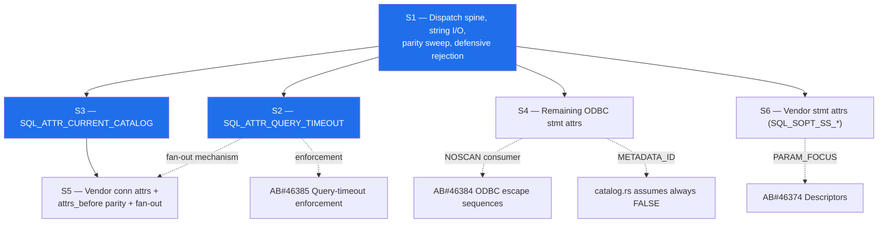

# AB#46377 — mssql-odbc | Connection & statement attributes

Proposed logical split of the work item, sized for independently shippable PRs.

**Consumer:** `microsoft/mssql-python`, replacing its in-package `msodbcsql18` with
this driver. Every slice below is justified by a call the Python layer actually
makes, or by the unfiltered pass-through surface it exposes (§4.10).

**Parity reference:** `C:\work\msodbcsql\Sql\Ntdbms\sqlncli\odbc\sqlcmisc.cpp`
(`ExportImp::SQLSetConnectAttrW` L1459, `SQLGetConnectAttrW` L2979,
`SQLSetStmtAttrW` L3508, `SQLGetStmtAttrW` L4186).

**Status:** S2 and S3 are implemented, with the string-I/O half of S1 pulled in as
a prerequisite. S1 (remaining), S4, S5 and S6 are open. Behavior marked *measured*
below was observed by running the same
`mssql-odbc/tests/e2e/tests/attributes_test.cpp` suite against msodbcsql18 and
against this driver.

---

## 1. Scope boundary

This story owns the **attribute contract**: accept, validate, store, read back,
and reject with the right SQLSTATE. It does **not** own the downstream behavior
those attributes drive — that is already split into sibling stories.

| Concern | Owner |
|---|---|
| Accept/store/read-back `SQL_ATTR_QUERY_TIMEOUT` | **46377** (this) |
| Actually cancelling a query on timeout | AB#46385 Query-timeout enforcement |
| `SQL_ATTR_NOSCAN` accept/store | **46377** |
| `{fn}` / `{ts}` / `{call}` translation when NOSCAN is off | AB#46384 ODBC escape sequences |
| `SQL_ATTR_APP_PARAM_DESC` / `APP_ROW_DESC` as attributes | **46377** |
| Descriptor handle semantics behind them | AB#46374 Descriptors |
| `SQL_ATTR_PARAMSET_SIZE` accept/store | **46377** |
| Array-bound `executemany` execution | AB#46576 Batch insert |
| `SQL_ATTR_RESET_CONNECTION`, `SQL_ATTR_CONNECTION_DEAD` | AB#47317 (Closed) |
| `SQL_ATTR_AUTOCOMMIT`, `SQL_ATTR_TXN_ISOLATION` | AB#46379 (Closed) |
| Connection-string keyword parsing | AB#46372 (Closed) |
| `SQLGetInfo` values | AB#46381 Driver info |

---

## 2. Verified current state

Read from `mssql-odbc/src/api/{set,get}_{connect,stmt,env}_attr.rs` at
`dev/saurabh/special-fortnight`.

### Environment (§4.2.1) — complete

`SQL_ATTR_ODBC_VERSION` handled in `set_env_attr.rs`. Pooling is client-side in
mssql-python, so `SQL_ATTR_CONNECTION_POOLING` is out of scope.

### Connection (§4.2.2)

| Attribute | Set | Get | Note |
|---|---|---|---|
| `SQL_ATTR_LOGIN_TIMEOUT` | ✅ | ✅ | clamped to `0xFFFE`, `01S02` on clamp |
| `SQL_ATTR_CONNECTION_TIMEOUT` | ✅ | ✅ | |
| `SQL_ATTR_PACKET_SIZE` | ✅ | ✅ | pre-connect only |
| `SQL_ATTR_ACCESS_MODE` | ✅ | ✅ | |
| `SQL_ATTR_AUTOCOMMIT` | ✅ | ✅ | |
| `SQL_ATTR_TXN_ISOLATION` / `SQL_COPT_SS_TXN_ISOLATION` | ✅ | ✅ | |
| `SQL_ATTR_RESET_CONNECTION` / `SQL_COPT_SS_RESET_CONNECTION` | ✅ | — | |
| `SQL_ATTR_CONNECTION_DEAD` | — | ✅ | |
| `SQL_COPT_SS_ACCESS_TOKEN` | ✅ | — | pre-connect only |
| `SQL_ATTR_ANSI_APP` | ✅ no-op | ✗ `HYC00` | deliberate |
| **`SQL_ATTR_CURRENT_CATALOG`** | ✅ | ✅ | **delivered by S3** |

Everything else → `SQL_ERROR` / `HY092` (was `HYC00`; see F3).

### Statement (§4.2.3)

| Attribute | Set | Get |
|---|---|---|
| `SQL_ATTR_CURSOR_TYPE` | ✅ | ✅ |
| `SQL_ATTR_CONCURRENCY` | ✅ | ✅ |
| `SQL_ATTR_ROW_ARRAY_SIZE` | ✅ | ✅ |
| `SQL_ATTR_ROWS_FETCHED_PTR` | ✅ | ✅ |
| `SQL_ATTR_ROW_STATUS_PTR` / `ROW_BIND_TYPE` | ✅ | ✅ |
| `SQL_ATTR_PARAMSET_SIZE` | ✅ | ✅ |
| `SQL_ATTR_APP_PARAM_DESC` / `APP_ROW_DESC` | ✅ no-op | ✅ |
| `SQL_ATTR_IMP_ROW_DESC` / `IMP_PARAM_DESC` | — | ✅ |
| `SQL_ATTR_PARAM_BIND_TYPE`, `PARAM_STATUS_PTR`, `PARAMS_PROCESSED_PTR`, `ROW_BIND_OFFSET_PTR` | ✅ no-op | ❌ |
| **`SQL_ATTR_QUERY_TIMEOUT`** | ✅ | ✅ | **delivered by S2** |

Everything else → `SQL_ERROR` / `HY092`.

---

## 3. Findings that shape the split

**F1 — `SQL_ATTR_QUERY_TIMEOUT` hard-fails.** `set_stmt_attr.rs:205` rejects it
with `HY092`. `mssql_python/cursor.py::_set_timeout` calls
`DDBCSQLSetStmtAttr(hstmt, SQL_ATTR_QUERY_TIMEOUT, ...)` whenever
`timeout > 0`, both at cursor creation and again in `executemany`. Python
swallows the error (`logger.warning`), so the symptom is a **silently ignored
timeout**, not a crash — worse than a hard failure. `execute.rs:101` confirms
nothing is wired.

**F2 — `SQL_ATTR_CURRENT_CATALOG` is unimplemented, and there is no string-output
path at all.** `sql_get_connect_attr_w_safe` took `_buffer_length` and
`_string_length_ptr` as *unused* parameters; every branch wrote a fixed-width
integer. Any character-typed connection attribute needs that plumbing first
(length negotiation, `01004` truncation, `SQL_NTS`). **Resolved:** `util.rs` now
carries `read_utf16_attr` / `write_wide_attr`, both with byte-count semantics.

**F3 — Unknown-attribute SQLSTATE is inconsistent and diverges from msodbcsql.**
`SQLSetConnectAttrW` returned `HYC00`; `SQLSetStmtAttrW` returns `HY092`.
msodbcsql's stmt path ends in `IDS_S1_092` (= `HY092`, `sqlcmisc.cpp:4177`), but
its **connect path does not have a rejecting default at all** — `sqlcmisc.cpp:2879`
falls through to `IsSetStmtOptionValid(...)` and, when the identifier is a valid
*statement* option, **fans it out to every statement on the connection**. That is
the ODBC "set a statement attribute through the connection handle" contract, and
this driver does not implement it generally. mssql-python's `attrs_before` is
applied unfiltered, so a caller can reach it. **Partly resolved:** both connect
catch-alls now return `HY092`, and the fan-out exists for `QUERY_TIMEOUT` only;
the general mechanism stays in S5.

> Note when reading the tests: id `1234` is a real undocumented `SQL_COPT_SS_*`
> identifier that msodbcsql accepts, so "unknown attribute" tests must use
> something outside the vendor range (`99999`).

**F4 — §4.10 pass-through is the real risk surface.** `attrs_before` accepts any
`int` key with an `int`/`str`/`bytes` value and applies it unfiltered before
connect. The requirement is *never crash, always a clean SQLSTATE* — that is a
property of the dispatch layer, testable exhaustively, and worth landing before
any individual attribute.

**F5 — Vendor attributes overlap already-shipped connection-string work.** AB#46372
closed the keyword parser. `SQL_COPT_SS_ENCRYPT`, `TRUST_SERVER_CERTIFICATE`,
`APPLICATION_INTENT`, `AUTHENTICATION`, `MULTISUBNET_FAILOVER`, `TNIR`,
`CONNECT_RETRY_*`, `SERVER_SPN`, `FAILOVER_PARTNER*`, `ATTACHDBFILENAME` are the
*attribute spellings of keywords the parser already understands*. The incremental
work is routing, not semantics — which makes them one cheap batch, not N stories.

---

## 4. Proposed split

Six subtasks. **S1–S3 are the mssql-python cutover blockers**; S4–S6 are parity
completeness.

---

### S1 — Attribute dispatch spine, string I/O, and defensive rejection

> `mssql-odbc | Attribute dispatch & pass-through hardening`

**Why first:** every other slice needs the table, the string plumbing, and the
rejection policy. Alone it discharges the §4.10 "never crash on unexpected input"
requirement.

**Already landed with S2/S3** (the parts those two could not proceed without):

- Character-attribute I/O in `util.rs`: `read_utf16_attr` (byte-count input,
  `SQL_NTS` passthrough) and `write_wide_attr` (honors `buffer_length`, writes
  `string_length_ptr`, returns `01004` + `SQL_SUCCESS_WITH_INFO` on truncation,
  treats a null `value_ptr` as a length query).
- `SQLGetConnectAttrW`'s `buffer_length` / `string_length_ptr` are real
  parameters instead of unused placeholders.
- Both connect-attribute catch-alls return `HY092` instead of `HYC00` (F3).
- `post_tds_error_as` in `sqlstate.rs`, for paths where msodbcsql forces a
  SQLSTATE over the error-number map.

**Still open**

- Single source-of-truth attribute table: `id → { scope, value kind (int / pointer /
  wide string), settable phase (pre-connect / post-connect / either), disposition
  (honored / accepted-no-op / not-implemented / invalid) }`. Replaces four
  hand-rolled `match` arms.
- Build the **msodbcsql truth table** systematically: table-driven e2e sweep over
  the attribute id space against the real driver, recording
  `(attr, phase, value) → (SQLRETURN, SQLSTATE)`. Everything downstream
  implements against measured behavior, not a guess. `attributes_test.cpp` is the
  hand-written seed of this.
- Finish reconciling rejection SQLSTATEs with msodbcsql: `HY092` invalid
  identifier, `HYC00` recognized-but-not-implemented, `HY024` invalid value,
  `HY011` wrong phase, `HY010` function sequence. Promote to `ERR_*` `DiagMsg`
  constants in `sqlstate.rs` per repo convention.
- Property/fuzz test sweeping the full `i32` identifier space × representative
  values, asserting no panic and a diagnostic record on every failure path.

**Acceptance:** no input to `SQLSet/GetConnectAttrW` or `SQLSet/GetStmtAttrW`
panics or returns `SQL_ERROR` without a retrievable `SQLGetDiagRec`; parity sweep
green; string round-trip covered by unit + e2e tests.

**Size:** M–L. **Depends on:** nothing.

---

### S2 — `SQL_ATTR_QUERY_TIMEOUT` — **delivered**

> `mssql-odbc | SQL_ATTR_QUERY_TIMEOUT attribute contract`

**Why second:** highest-frequency consumer path that is silently broken today (F1).

**Measured msodbcsql18 behavior** (id 0), now matched:

| Probe | msodbcsql18 |
|---|---|
| statement default | `0` |
| `SQLSetStmtAttrW(30)` then get | `30` |
| `SQLSetStmtAttrW(0xFFFE)` | `SQL_SUCCESS`, no warning |
| `SQLSetStmtAttrW(0x10000)` | `SQL_SUCCESS_WITH_INFO` + `01S02`, reads back `0xFFFE` |
| `SQLSetConnectAttrW(...)` | `SQL_SUCCESS`; applied to statements already open |
| statement allocated afterwards | inherits the connection value |
| `SQLGetConnectAttrW(...)` | **`HY092`** — write-only on the connection |

**Scope**
- Accept on `SQLSetStmtAttrW`, store on `StmtHandle` state, read back on
  `SQLGetStmtAttrW`. Default `0` (no timeout).
- Validate and clamp to msodbcsql's `MAX_QUERY_TIMEOUT` (`0xFFFE`), reusing the
  existing clamp + `01S02` pattern from `set_connect_attr.rs:28`
  (`sqlcmisc.cpp:3988-3994`).
- Connection-handle route: `SQLSetConnectAttr(SQL_ATTR_QUERY_TIMEOUT)` sets the
  default for statements on that connection and fans out to the ones already
  open (`sqlcmisc.cpp:2879-2935`). The fan-out is deliberately implemented only
  for this attribute; the general mechanism stays in S5.
- Inheritance: a statement allocated after the connection default is set picks
  it up (`sqlcfunc.cpp:173`); an explicit per-statement set overrides.
- `SQLGetConnectAttrW` deliberately has **no** arm, so it falls through to
  `HY092` exactly as msodbcsql does (`sqlcmisc.cpp:4378`).

**Explicitly out of scope:** enforcing the timeout (cancel/abort on expiry) —
AB#46385. This is a **known, deliberate divergence**: msodbcsql returns `HYT00`
after N seconds on a long query, this driver runs the query to completion. No
e2e test asserts enforcement, so the parity suite stays green either way.

**Acceptance:** `cursor.timeout = N` in mssql-python stops logging
"Failed to set query timeout"; value round-trips through get; clamp + `01S02`
matches msodbcsql.

**Size:** S–M. **Depends on:** S1 (table, SQLSTATE policy).

---

### S3 — `SQL_ATTR_CURRENT_CATALOG` — **delivered**

> `mssql-odbc | SQL_ATTR_CURRENT_CATALOG`

**Why third:** the only remaining §4.2.2 attribute, and it is on mssql-python's
`validate_attribute_value` allowlist — i.e. reachable from the *public*
`Connection.setattr` API, not just `attrs_before`.

**Measured msodbcsql18 behavior** (id 109), now matched:

| Probe | msodbcsql18 |
|---|---|
| get after connect | the database the session is actually in |
| set to a different database | `SQL_SUCCESS_WITH_INFO`, info `01000` native **5701** |
| set to the same name, different case | `SQL_SUCCESS`, **no round trip** |
| set to `(Default)` | `SQL_SUCCESS`, no-op |
| set to a nonexistent database | `HY024` + native **911**, catalog unchanged |
| set to `""` | `HY024` |
| set to > 128 UTF-16 units | `HY024` |
| `StringLength = -7` | `HY090` |
| plain `USE other_db` in user SQL | attribute follows it (live `ENVCHANGE`) |
| get into a short buffer | `01004`, `*StringLength` = **full** byte length |
| get with a null buffer | length query |
| set while a cursor is open | **`24000`**, rejected outright |
| set inside a transaction | succeeds, `@@TRANCOUNT` preserved |
| set to `tempdb]; DROP …` | stays one identifier |

Two details worth calling out because they are not derivable from the ODBC spec:

- **`HY024` overrides the error-number map.** Server error 911 normally maps to
  `08004`, and this driver's `SERVER_ERROR_TO_SQL_STATE_MAP` agrees. But
  `sqlcmisc.cpp:1873-1875` forces `IDS_HY_024` whenever the failure came from the
  server, so the catalog path needs `post_tds_error_as` to override the lookup.
- **`StringLength` is a byte count, not a character count.** The Driver Manager
  resolves `SQL_NTS` to bytes before the driver sees it. Reading it as UTF-16
  units appends whatever follows the terminator, and the server rejects the
  result with native 1055 ("invalid name … contains a NULL character"). Hence
  `read_utf16_attr`.

**Scope**
- **Set pre-connect:** seeds the login packet's database. The connection string's
  `Database=` keyword still wins if both are supplied, matching msodbcsql, which
  overwrites `conninfo.DataBase` while parsing keywords.
- **Set post-connect:** emits `USE [<db>]` with `]` doubled for quoting
  (`sqlcfunc.cpp:1933-1972` always bracket-quotes). A transaction stays open
  across the switch; an **open cursor is rejected with `24000`** rather than
  closed.
- **Get:** returns the *live* database, tracked from the TDS `ENVCHANGE` token
  (so a server-side `USE` or a failover-induced change is reflected), falling
  back to the pre-connect value. Uses the S1 string-output path.
- Interaction with `SQL_ATTR_RESET_CONNECTION` on pool check-in: confirm the
  catalog resets with the session.

**Acceptance:** set/get round-trip pre- and post-connect; buffer-truncation
returns `01004`; e2e parity against msodbcsql including the open-cursor `24000`
rejection and the `HY024`/native-911 mapping for a nonexistent database.

**Size:** M. **Depends on:** S1 (string I/O).

---

### S4 — Remaining ODBC-standard statement attributes

> `mssql-odbc | Remaining ODBC statement attributes`

**Scope** — for each, either honor it or reject with msodbcsql's exact SQLSTATE;
no silent success. Derived from `sqlcmisc.cpp:3508` case labels minus what already
works and minus S2:

`SQL_ATTR_MAX_ROWS`, `SQL_ATTR_MAX_LENGTH`, `SQL_ATTR_NOSCAN`,
`SQL_ATTR_RETRIEVE_DATA`, `SQL_ATTR_METADATA_ID`, `SQL_ATTR_CURSOR_SCROLLABLE`,
`SQL_ATTR_CURSOR_SENSITIVITY`, `SQL_ATTR_ENABLE_AUTO_IPD`,
`SQL_ATTR_USE_BOOKMARKS`, `SQL_ATTR_FETCH_BOOKMARK_PTR`, `SQL_ATTR_KEYSET_SIZE`,
`SQL_ATTR_SIMULATE_CURSOR`, `SQL_ATTR_ASYNC_ENABLE`,
`SQL_ATTR_PARAM_OPERATION_PTR`, `SQL_ATTR_ROW_OPERATION_PTR`,
`SQL_ATTR_PARAM_BIND_OFFSET_PTR`, `SQL_ROWSET_SIZE`, plus get-only
`SQL_ATTR_ROW_NUMBER`.

Also closes the asymmetry where four attributes accept a set but reject the get
(`PARAM_BIND_TYPE`, `PARAM_STATUS_PTR`, `PARAMS_PROCESSED_PTR`,
`ROW_BIND_OFFSET_PTR`) — an app that writes then reads currently gets `HY092`.

**Cross-story notes:** `SQL_ATTR_NOSCAN` must be readable by AB#46384;
`SQL_ATTR_METADATA_ID` contradicts `catalog.rs:767`, which hardcodes "never TRUE"
— either wire it through or document the divergence there.

**Size:** M. **Depends on:** S1.

---

### S5 — Connection attributes: vendor + remaining standard, and `attrs_before` parity

> `mssql-odbc | Vendor connection attributes & attrs_before parity`

**Scope**
- **Route to existing keyword settings (F5)** so the keyword path and the
  attribute path land on the same place: `SQL_COPT_SS_ENCRYPT`,
  `TRUST_SERVER_CERTIFICATE`, `AUTHENTICATION`, `APPLICATION_INTENT`,
  `MULTISUBNET_FAILOVER`, `TNIR`, `CONNECT_RETRY_COUNT`, `CONNECT_RETRY_INTERVAL`,
  `SERVER_SPN`, `FAILOVER_PARTNER`, `FAILOVER_PARTNER_SPN`, `ATTACHDBFILENAME`,
  `INTEGRATED_SECURITY`, `OLDPWD`.
- **Precedence rule**: decide and test what wins when both the connection string
  and a pre-connect attribute set the same thing. Verify against msodbcsql — do
  not assume.
- **Read-only/diagnostic:** `SQL_COPT_SS_CLIENT_CONNECTION_ID`, `SQL_COPT_SS_SPID`,
  `SQL_COPT_SS_USER_DATA`.
- **Standard leftovers:** `SQL_ATTR_METADATA_ID`, `SQL_ATTR_ASYNC_ENABLE`,
  `SQL_ATTR_AUTO_IPD`, `SQL_ATTR_TRANSLATE_LIB`, `SQL_ATTR_TRANSLATE_OPTION`.
- **Implement the statement-option fan-out (F3)** so an unrecognized connection
  attribute that is a valid statement option propagates to the connection's
  statements, as msodbcsql does at `sqlcmisc.cpp:2879`.
- **Deferred, but cleanly rejected** with the SQLSTATE msodbcsql uses (not a
  generic `HYC00` if msodbcsql differs): MARS (`SQL_COPT_SS_MARS_ENABLED`),
  Always Encrypted (`COLUMN_ENCRYPTION`, `CEKEYSTOREPROVIDER`, `CEKEYSTOREDATA`,
  `CEKCACHETTL`, `TRUSTEDCMKPATHS`), DTC/XA enlistment, BCP, perf counters,
  browse-connect, `SQL_COPT_SS_QUOTED_IDENT` / `ANSI_NPW` / `CONCAT_NULL`.

**Acceptance:** every id in `sqlcmisc.cpp`'s connect switch is either honored or
returns the same `(SQLRETURN, SQLSTATE)` as msodbcsql under the S1 parity sweep;
an `attrs_before` dict mixing supported, deferred, and garbage keys behaves
identically to msodbcsql.

**Size:** L — split further if the routing and the fan-out both grow.
**Depends on:** S1, S3 (string I/O for the character-typed ones).

---

### S6 — Vendor statement attributes (`SQL_SOPT_SS_*`)

> `mssql-odbc | Vendor statement attributes`

**Scope:** `TEXTPTR_LOGGING`, `CURRENT_COMMAND`, `HIDDEN_COLUMNS`,
`NOBROWSETABLE`, `REGIONALIZE`, `CURSOR_OPTIONS`, `NOCOUNT_STATUS`,
`DEFER_PREPARE`, `QUERYNOTIFICATION_*`, `PARAM_FOCUS`, `NAME_SCOPE`,
`COLUMN_ENCRYPTION`. Mostly clean rejection; `DEFER_PREPARE` and `PARAM_FOCUS`
are the two with real semantics (`PARAM_FOCUS` couples to AB#46374 Descriptors).

**Why last:** mssql-python does not set any of these. Value is pass-through
robustness and parity-sweep completeness only.

**Size:** S–M. **Depends on:** S1.

---

## 5. Sequencing



Blue = mssql-python cutover blockers. **S2 and S3 have landed**, along with the
string-I/O and SQLSTATE-policy parts of S1. S4/S5/S6 parallelize once the rest of
S1 lands.

---

## 6. Risks & open questions

1. **Statement-option fan-out (F3)** is a structural change to `SQLSetConnectAttrW`,
   not an attribute addition. If it proves large, split it out of S5 into its own
   subtask — S2 only needs the narrow `QUERY_TIMEOUT` case.
2. **Attribute vs. keyword precedence (S5)** is unspecified in the reference doc.
   Must be measured against msodbcsql; getting it backwards is a silent
   misconfiguration, not a visible error.
3. **`SQL_ATTR_METADATA_ID`** conflicts with a documented assumption in
   `catalog.rs`. Needs a decision — implement or record as a deliberate deviation
   per the crate's parity-instructions convention.
4. **`SQL_ATTR_CURRENT_CATALOG` get semantics**: last-written value vs. live
   `ENVCHANGE`-tracked value. The live value is correct and is what msodbcsql
   does; it requires the TDS layer to surface database changes.
5. **Parity-sweep cost:** S1's sweep needs a live SQL Server and both drivers
   registered. If `--compare-with-msodbcsql` cannot run in CI, the truth table
   must be captured once and checked in as a fixture.

---

## 7. Work-item bookkeeping

The story text asks: *"If covering all necessary attributes is not possible right
now, add a list of what was done & what is pending in this story & create subtasks
for pending attributes."*

- §2 above is the "what is done" list — paste into AB#46377.
- S1–S6 are the subtasks. S2 and S3 are complete; the string-I/O and
  SQLSTATE-policy parts of S1 came with them.
- Recommend leaving AB#46377 Active tracking the remainder of S1 plus S4–S6, or
  converting it to a parent and letting the subtasks carry the remaining scope.

---

## 8. Verifying parity locally

`mssql-odbc/tests/e2e/tests/attributes_test.cpp` is written against the ODBC API,
not against this driver, so the same binary runs on either driver. Point it at
msodbcsql18 first to confirm the expectations encode real behavior, then at this
driver:

```powershell
$env:ODBC_TEST_SERVER   = 'localhost'
$env:ODBC_TEST_DATABASE = 'tempdb'
$env:ODBC_TEST_TRUST_CERT = 'Yes'

# baseline
$env:ODBC_TEST_DRIVER = 'ODBC Driver 18 for SQL Server'
.\build\attributes_test.exe

# this driver
$env:ODBC_TEST_DRIVER = 'mssql-odbc dev'
.\build\attributes_test.exe
```

Two constraints worth knowing before adding cases:

- Assertions about a **never-connected** handle cannot live here. The Driver
  Manager answers `SQLGetConnectAttr` with `08003` itself and never reaches the
  driver, so those belong in Rust unit tests.
- A fixture helper that runs its own query fails with a Driver-Manager `24000`
  if a cursor is already open on the shared statement. Resolve every value the
  assertion needs *before* opening the cursor under test.
