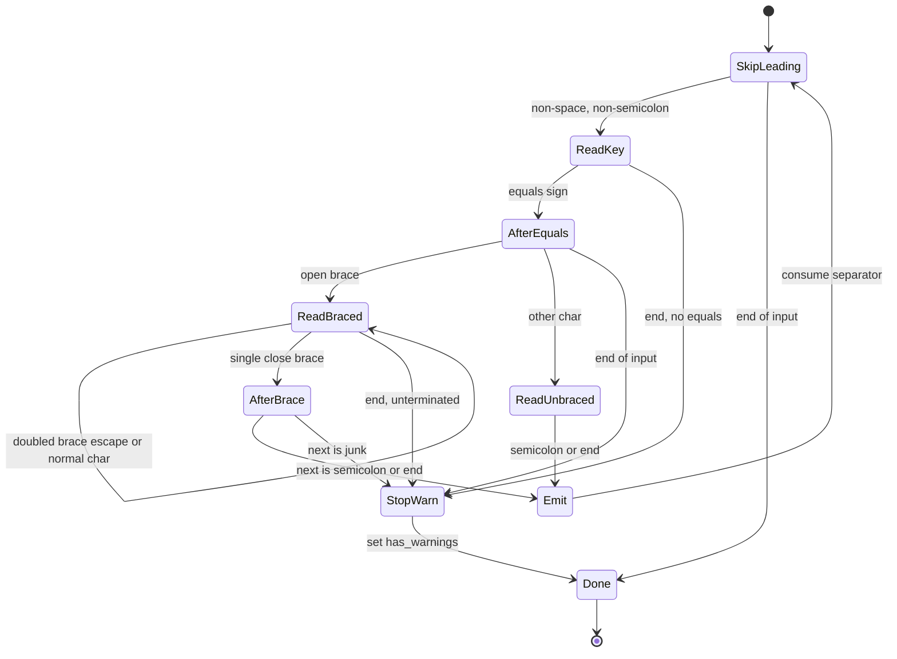

# ODBC Connection String Parser

`mssql-odbc/src/connection/mod.rs` parses the connection string handed to
`SQLDriverConnect` / `SQLBrowseConnect`. It is a single-pass,
character-by-character **state machine** that reproduces the behavior of the
shipping msodbcsql driver's `ParseAttrStr`
(`Sql/Ntdbms/sqlncli/odbc/sqlcconn.cpp`). The goal is byte-for-byte parity with
the C++ driver, **including its quirks**, so that applications migrating from
`msodbcsql18` see identical parsing semantics.

## Why a state machine (and not token splitting)

The previous implementation used a two-phase design: a `tokenize` pass that split
the string on `;`, trimmed each key/value, and stored them in a `Vec`, followed by
an interpretation pass. That approach is *convenient* but does **not** match ODBC.
The msodbcsql parser walks the string one character at a time and makes decisions
inline, which produces observably different results in several cases:

| # | Input | Old tokenizer | msodbcsql `ParseAttrStr` (now) |
|---|-------|---------------|--------------------------------|
| 1 | `Server=h;bogus;UID=u` | `bogus` skipped, `UID=u` set | key becomes `bogus;UID` (scan reads through `;`); unknown → ignored; **UID never set** |
| 2 | token with no `=` | skip token, **continue** | `S_FALSE`, **stop parsing** |
| 3 | `Server =h` (space before `=`) | trimmed → matches `Server` | key = `"Server "` → **no match**, ignored |
| 4 | `Key= v ` (spaces in value) | trimmed to `v` | value = `" v "` verbatim |
| 5 | `PWD={a}}b}` | value `a`, rest skipped | value `a}b` (`}}` escape) |
| 6 | `PWD={val}junk;X=y` | `val`, skip to `;`, continue | `S_FALSE`, **stop** (junk after `}`) |
| 7 | unterminated `{` | warn, keep partial, continue | `S_FALSE`, stop |
| 8 | recognized-but-unsupported key (e.g. `QuotedId`) | warns / small allow-list | recognized → **no warning** |

These are semantic differences, not cosmetic ones, so the tokenizer could not be
patched into fidelity — it had to be replaced by the single-pass scanner.

## The algorithm

For each key/value pair, repeated until end of input:

1. **Skip leading** runs of ODBC whitespace **and** the separator `;`.
   ODBC whitespace (`ISSPACE`) is exactly `space \f \n \r \t \v` — deliberately
   narrower than Rust's `char::is_whitespace` (e.g. a non-breaking space is *not*
   skipped).
2. **Read the key** up to `=`. The scan **reads through `;`** — it stops only on
   `=` or end-of-input. A token lacking its own `=` therefore merges with the text
   that follows it.
3. **No `=` in the remainder** → set the warning flag and **stop parsing**
   entirely (everything parsed so far is kept). This is msodbcsql `S_FALSE` +
   `goto RetExit`.
4. **Classify the key** (case-insensitive, **no trimming**):
   - *Mapped* — a key we act on. First occurrence stores the value; duplicates are
     discarded (**first-wins**).
   - *Ignored* — recognized by msodbcsql but not acted on here (e.g. `Driver`,
     `DSN`, `ApplicationIntent`, `OEMToANSI`). No warning.
   - *Unknown* — not in the table. Raises an `01S00` warning, but **parsing
     continues** to the next pair; the value is parsed and discarded. Never fails
     and never halts the scan.
5. **After `=`, if at end-of-input** → warning + **stop** (value never set).
6. **Read the value**:
   - `{`-prefixed → **braced**: ends at a single `}`; `}}` is an escape for a
     literal `}`. An unterminated brace consumes the rest of the string, warns, and
     stops. After the closing `}`, the next character must be `;` or end-of-input;
     anything else warns and stops (the value is still stored first).
   - otherwise → **unbraced**: ends at the next `;` or end-of-input.
   - The value is copied **verbatim** — no trimming.
7. **Validate & store** for mapped keys. An invalid value on a *validated* key is a
   hard error (`E_FAIL` → `Err(InvalidAttrValue)`), returned immediately.

### State diagram

## Return codes → ODBC diagnostics

| msodbcsql | Meaning | Rust surface | ODBC result |
|-----------|---------|--------------|-------------|
| `S_OK` | clean parse | `Ok((params, false))` | `SQL_SUCCESS` |
| `S_FALSE` | warning condition | `Ok((params, true))` | `01S00` + `SQL_SUCCESS_WITH_INFO` |
| `E_FAIL` | invalid value on a validated key | `Err(InvalidAttrValue)` | connect fails |

`S_FALSE` (the `01S00` warning) is raised by two different classes of condition,
and they behave differently with respect to the rest of the string:

**Warn and continue** — an **unknown / unrecognized keyword**. msodbcsql sets
`hr = S_FALSE` but does *not* `goto RetExit`, so the loop keeps going. Because `hr`
is never reset back to `S_OK`, the warning "sticks" and is returned at the end —
but **every later key/value pair is still parsed and stored.**

**Warn and stop** — a **structural malformation**, each of which does
`goto RetExit` and abandons the rest of the string:

- no `=` in the remainder (key with no separator),
- no value after `=` (end-of-input right after `=`),
- an unterminated `{` brace,
- data after the closing `}` of a braced value.

So a single unknown keyword does **not** halt parsing, whereas any of the four
structural problems halts it immediately. In both cases whatever was parsed before
the stopping point is kept.

Only an invalid **value** on a recognized, validated key is a hard error: msodbcsql
returns `E_FAIL` (→ `Err(InvalidAttrValue)`) and the connect fails. Unknown or
invalid *keywords* never fail.

## Value validation

Whole-value, case-insensitive, exact match (not prefix, not `y`/`1`):

- **Yes/No** keys (`TrustServerCertificate`, `Trusted_Connection`): `Yes` | `No`.
- **`Encrypt`**: `Yes` | `Mandatory` | `No` | `Optional` | `Strict`.
- **`Authentication`**: delegated to `is_recognized_keyword`
  (`odbc_supported_auth_keywords.rs`) so the accept/reject set never drifts from
  mssql-tds. An empty value is a recognized reset.

## Keys we recognize but do not act on

`KNOWN_IGNORED_KEYS` mirrors the non-acted-on entries of msodbcsql's `x_rgLookup`
table (synonyms and deprecated keys included) so that recognized-but-unsupported
keys stay silent. Notably, unlike ADO.NET / OLE DB, the msodbcsql ODBC parser does
**not** recognize `Initial Catalog`, `User Id`, or `Password`; those are treated as
unknown keys here, matching the driver.

## Intentional non-goals

The C++ parser has a few behaviors that are artifacts of its fixed-size buffers
rather than deliberate contract, and are **not** reproduced:

- The `MAXPATHLEN` (261) value-length cap and per-key length limits — these would
  reject otherwise-legitimate long values with no benefit.
- The `MAXKEYLEN` (31) key-length cap has no observable effect (no mapped key is
  that long), so it is omitted.

## Tests

Exhaustive unit tests live in the `#[cfg(test)] mod tests` block of
`connection/mod.rs` and cover every quirk in the divergence table above plus
value validation, first-wins duplicates, whitespace fidelity, `}}` escaping,
separator/empty-input edge cases, and the `S_OK` / `S_FALSE` / `E_FAIL` mapping.
Run them with `cargo btest` (or `cargo nextest run -p mssql-odbc`).
