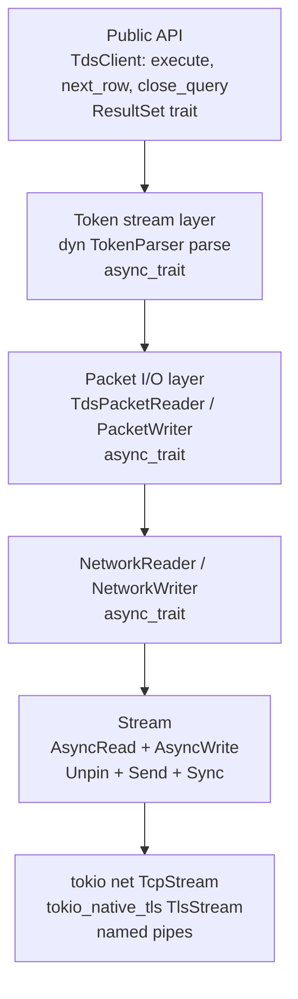
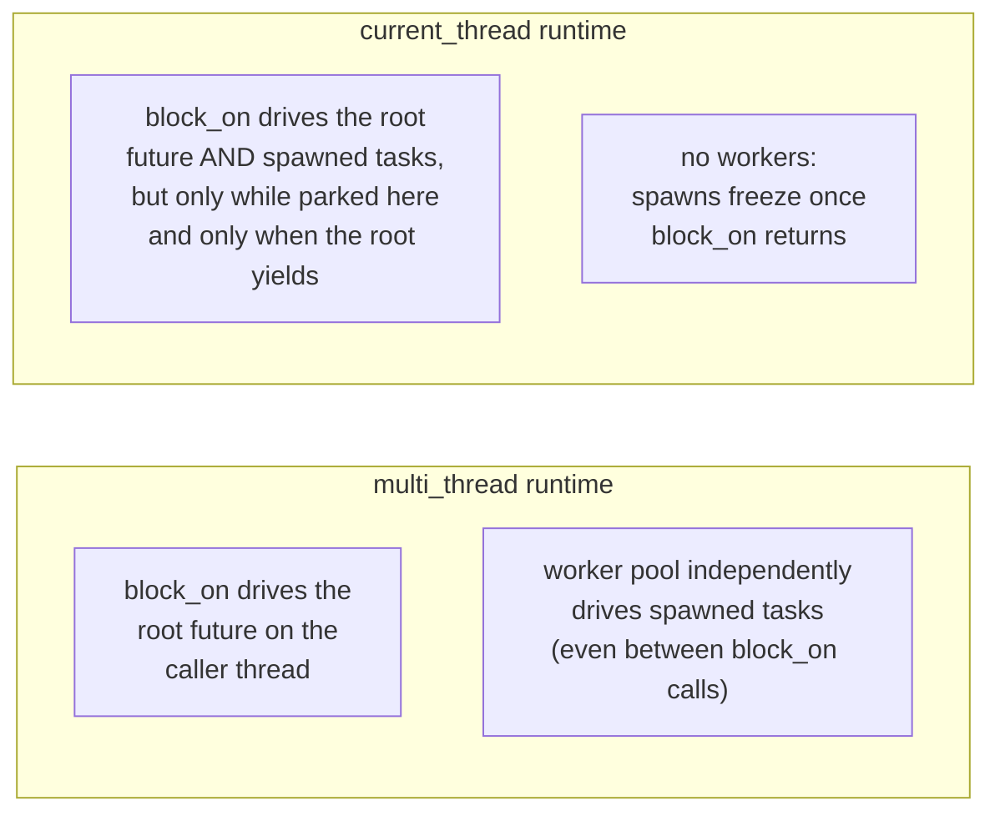

# Choosing a Tokio Runtime for `mssql-odbc`

> Status: exploratory. This document reasons about *which* Tokio runtime
> configuration the ODBC driver should use and why. It is a design rationale,
> not a description of the current (experimental) wiring.

## 1. Agenda

`mssql-odbc` is a synchronous C ABI sitting on top of `mssql-tds`, which is
asynchronous to its core. Something has to bridge the two, and that something is
a Tokio runtime owned by the driver.

The question this document answers:

> **Which Tokio runtime flavor and scope should `mssql-odbc` use, given that
> ODBC is a blocking C API, `mssql-tds` is async, and applications call our
> exported functions from threads we do not control?**

To answer it we need to understand, in order (click to jump):

1. [How `mssql-tds` uses async](#2-how-mssql-tds-leverages-async) — what we are
   bridging *to*.
2. [The nature of ODBC calls](#3-the-nature-of-odbc-api-calls) — both the classic
   synchronous model and the `SQL_STILL_EXECUTING` async model (what we are
   bridging *from*).
3. [Two Tokio fundamentals](#4-two-tokio-fundamentals-everything-else-depends-on)
   that every later decision depends on.
4. [Sync ODBC: `multi_thread` vs `current_thread`](#5-sync-odbc--multi_thread-vs-current_thread) tokio runtime.
5. [Async ODBC: `multi_thread` vs `current_thread`](#6-async-odbc--multi_thread-vs-current_thread) tokio runtime.
6. [Runtime *scope*](#7-runtime-scope--where-should-the-runtime-live) — global vs
   per-ENV vs per-DBC vs per-STMT vs per-thread.
7. [A concrete recommendation](#8-conclusion--recommendation).

## TL;DR - the decision

> **Use a single `multi_thread` Tokio runtime per ODBC environment (ENV), with a
> small fixed `worker_threads` count (start at 1, tune to 2–4). Share it with all
> child connections and statements via `Arc<Runtime>`.**
>
> Why, in one line each:
>
> - **`multi_thread`, not `current_thread`** — it's the only flavor that can drive
>   a spawned async query *between* the app's polls (the background-progress design
>   for `SQL_STILL_EXECUTING`), and it lets multiple app threads call in without
>   contending on one scheduler.
> - **Per-ENV, one shared runtime** — a connection is pinned to the runtime that
>   created it (reactor affinity); one shared runtime means any app thread can
>   drive any connection. Per-DBC/per-STMT wastes thread pools; per-thread and
>   two-runtime splits break cross-thread connection use.
> - **Small fixed worker count** — sync `block_on` runs on the *calling* thread
>   anyway, and async ODBC is I/O-bound (msodbcsql caps it at 1 concurrent op per
>   connection), so a couple of workers suffice. Tokio pools aren't resizable, so
>   pick a value up front.
>
> The rest of this document is the *why* behind that one box.

## Key terms

> The argument leans on a handful of Tokio concepts. If any are unfamiliar, anchor
> on these before reading on:
>
> | Term | Meaning in this doc |
> | --- | --- |
> | **Runtime** | A Tokio executor instance. Owns a scheduler + an I/O **reactor**. Built via `Builder::new_multi_thread()` or `new_current_thread()`. |
> | **`block_on(fut)`** | Drives `fut` to completion on the **calling** thread, blocking it. The bridge from sync ODBC to async `mssql-tds`. |
> | **Worker thread** | A runtime-owned thread that runs `tokio::spawn`'d tasks. `multi_thread` has N; `current_thread` has 0. |
> | **`tokio::spawn`** | Hands a future to the runtime's scheduler (→ a worker). Returns a `JoinHandle`. |
> | **Reactor (I/O driver)** | The per-runtime epoll/kqueue/IOCP loop that watches sockets and fires **wakers** when they're ready. |
> | **Waker** | The callback a future registers so the reactor can re-poll it when its socket is ready. Re-registered on every poll. |
> | **Reactor affinity** | A socket (hence a `TdsClient`) is bound to the **runtime** that created it; it can only be `.await`ed on that same runtime. Affinity is to the *runtime*, never to a thread. |

## Reading paths

- **Just want the decision?** Read the *TL;DR* above and [§8](#8-conclusion--recommendation).
- **Want the reasoning?** Read straight through the numbered sections; each one
  is a consequence of the two facts in [§4](#4-two-tokio-fundamentals-everything-else-depends-on).
- **Want how the reference driver (msodbcsql) does it?** Jump to
  [Appendix A](#how-msodbcsql-handles-async).

---

## 2. How `mssql-tds` leverages async

`mssql-tds` is **async-from-the-socket-up**. There is no synchronous code path
and no internal runtime — it assumes a Tokio runtime is provided by the caller.



Key facts that matter for the runtime decision:

| Property | Detail |
| --- | --- |
| **Tokio-coupled** | Uses `tokio::net::TcpStream`, `tokio_native_tls`, `tokio::time::timeout`, `tokio_util::sync::CancellationToken`, and `tokio::spawn`. It needs Tokio specifically, not just any executor. |
| **Never builds a runtime** | The crate calls `tokio::spawn` / `.await` and assumes an ambient runtime exists. The *consumer* owns the runtime. |
| **Half-duplex per connection** | TDS is request → full response → next request. One `TdsClient` does one thing at a time. No parallelism *within* a connection. |
| **Concurrency scales across connections** | Multiple `TdsClient`s on separate connections can progress concurrently on the runtime. The one-at-a-time rule is per connection, not process-wide. |
| **Real concurrency only at connect** | `parallel_connect` uses `tokio::spawn` to race up to 64 IPs (MultiSubnetFailover); SSRP uses `tokio::spawn` for a UDP listener; Windows named-pipe open uses `spawn_blocking`. The steady-state query path is a single linear chain of `.await`s. |

**Implication:** the runtime's job for `mssql-odbc` is overwhelmingly
*non-blocking I/O + cancellation + timeouts for one operation at a time per
connection*; throughput scales by having multiple active connections, not by
trying to pipeline a single connection. The only place a worker pool earns
extra keep *within one connection* today is `parallel_connect`.

---

## 3. The nature of ODBC API calls

ODBC exposes two execution models. The runtime choice interacts with each
differently, so we treat them separately throughout.

### 3a. Synchronous ODBC (the default)

The Driver Manager calls an exported function and **blocks on its return
value**:

```c
SQLExecDirectW(hstmt, L"SELECT ...", SQL_NTS);   // returns only when done
```

The driver must drive the async TDS work to completion *before returning*. That
is a `block_on`:

```rust
let rc = runtime.block_on(client.execute(sql, None, None));
```

The calling thread is parked inside `block_on` until the query finishes.

### 3b. Asynchronous ODBC (`SQL_STILL_EXECUTING`)

With `SQL_ATTR_ASYNC_ENABLE` set, the contract changes:

1. `SQLExecDirect` **starts** the work and returns `SQL_STILL_EXECUTING`
   immediately.
2. The application thread leaves the driver and does other work.
3. The application later re-calls the function (or `SQLFetch`); the driver
   reports `SQL_STILL_EXECUTING` until the work is done, then the real result.

From the **application's** side, the pattern is a poll loop — the same function
is called repeatedly with identical arguments until it stops returning
`SQL_STILL_EXECUTING`:

```c
// Enable async execution on the statement handle.
SQLSetStmtAttr(hstmt, SQL_ATTR_ASYNC_ENABLE,
               (SQLPOINTER)SQL_ASYNC_ENABLE_ON, 0);

SQLRETURN rc;
// First call kicks off the work; subsequent identical calls poll it.
do {
    rc = SQLExecDirectW(hstmt, L"SELECT * FROM big_table", SQL_NTS);
    if (rc == SQL_STILL_EXECUTING) {
        do_other_work();   // app thread is free; driver makes progress elsewhere
    }
} while (rc == SQL_STILL_EXECUTING);

// rc is now SQL_SUCCESS / SQL_ERROR / etc. — fetch as usual (also async-capable).
do {
    rc = SQLFetch(hstmt);
} while (rc == SQL_STILL_EXECUTING);
```

The application thread spends most of its time **outside** the driver (inside
`do_other_work()` above), re-entering only to poll. A driver can honor this two
ways:

- **Background progress** — hand the work to a *live worker* that advances it
  while the app is away, so the result is often ready by the next poll. Lowest
  latency; needs a worker thread (the design this document favors — see §6).
- **Foreground progress** — keep the in-flight future on the statement and
  advance it a little *during* each poll call, making no progress between polls.
  Needs no worker; this is what msodbcsql does (Appendix A).

Both are spec-compliant — they differ in latency, not correctness. The ODBC
contract only requires that re-polling *eventually* returns the result; it does
**not** mandate progress between polls. The rest of this document evaluates the
runtime through the background-progress lens, since that is the design we favor.

### 3c. The threading reality we cannot change

> Applications create their own threads (say 4 worker threads) and call ODBC
> functions from each. **`mssql-odbc` does not own or control those threads.**

So any design that depends on "spawn our own thread per X" must do so
explicitly; we cannot assume the caller's threads behave a certain way, and we
cannot attach lifecycle to threads we did not create (except via
`thread_local!`, which attaches to *whatever* thread calls in).

---

## 4. Two Tokio fundamentals everything else depends on

Before comparing flavors, pin down two facts. Every later table is a
consequence of these.

### Fact 1 — `block_on` drives the root future on the **calling** thread

For **both** `current_thread` and `multi_thread` runtimes, `Runtime::block_on`
polls the root future on the thread that called it. The calling thread *is* the
executor for that future — it is never shipped off to a worker, and
work-stealing cannot touch it (stealing only applies to `spawn`'d tasks).

So every sequential `.await` inside the block runs on the calling thread:

```rust
// Called from thread A:
runtime.block_on(async {
    sleep(1).await;      // polled on A (the timer fires elsewhere, but only wakes A)
    print(x);            // plain sync code — runs on A
    read_file(Y).await;  // polled on A
});
```

All three run on thread A, one after another — even on a `multi_thread`
runtime. A worker thread only gets involved if you explicitly `tokio::spawn`
inside the block; that spawned task is a *separate* future and may run on a
worker. The reactor (timers, epoll) may live on a runtime thread, but it only
*wakes* thread A — it never runs your block's code.

Consequence: if 4 application threads each call `runtime.block_on(...)`, each
root future is driven on its own calling thread. You do **not** need 4 workers
for that — you need 4 callers, which you already have.

### Fact 2 — `tokio::spawn` only progresses while a thread is driving the runtime

`tokio::spawn` schedules a task onto the runtime's scheduler and returns a
`JoinHandle`. The question is *who polls that task*, and the two flavors differ.

**`multi_thread`** has N persistent worker threads. A spawned task is driven by
a worker immediately and independently — it progresses even while no one is
inside `block_on`.

**`current_thread`** has **zero** worker threads. The *only* driver is whatever
thread is currently inside `block_on`. A spawned task therefore progresses
**only when both** of these hold:

1. A thread is inside `block_on` on that runtime, **and**
2. the root future *yields* (hits an `.await` that returns `Pending`), handing
   control to the scheduler so it can interleave the spawned task.

Once `block_on` returns, the scheduler is dormant and any unfinished spawned
task is **frozen** until the next `block_on`.

```rust
// current_thread runtime
rt.block_on(async {
    let h = tokio::spawn(async {
        sleep(Duration::from_millis(100)).await;
        println!("spawned done");        // DOES print (~100ms)
        42
    });

    sleep(Duration::from_millis(200)).await; // root YIELDS here →
                                             // scheduler drives the spawn
    h.await.unwrap()                          // already finished
});
```

The spawn makes progress because the root's `sleep(200ms).await` parks the
thread *inside* `block_on`, giving the scheduler a chance to run the spawned
task. Two ways this breaks on `current_thread`:

- **Spawn-and-return:** if `block_on` returns before the spawn finishes (e.g.
  `SQLExecDirect` spawns the query and returns `SQL_STILL_EXECUTING`), the task
  freezes — nothing drives it until the app calls back in.
- **Synchronous blocking:** if the root runs `std::thread::sleep(...)` (or any
  blocking call) instead of `.await`, it never yields, so the single thread
  never services the spawn until a later yield point.

On `multi_thread`, neither case is a problem — a worker drives the spawn
regardless.



With these two facts, the comparisons below are almost mechanical.

---

## 5. Sync ODBC — `multi_thread` vs `current_thread`

Recall the sync path is `runtime.block_on(one_operation)`. By Fact 1 the work
runs on the calling thread regardless of flavor. The only difference is what
happens to `tokio::spawn`'d sub-tasks (i.e. `parallel_connect`, SSRP) and how
many threads the process pays for.

| Aspect | `multi_thread` | `current_thread` |
| --- | --- | --- |
| Root future (the query) runs on | Calling thread (Fact 1) | Calling thread (Fact 1) |
| `parallel_connect` IP race | True parallel — spawned connects run on workers | Concurrent only — connects interleave on the calling thread at `.await` points |
| OS threads added by driver | N workers (idle most of the time for ODBC) | 0 |
| Multiple app threads calling `block_on` | Each drives its own future; workers shared (mostly idle) | Each `block_on` spins its own scheduler instance only if each thread has its **own** runtime; sharing one `current_thread` runtime across threads makes them contend |
| Footprint | Heavier (worker pool per runtime) | Minimal |
| Behavior correctness | Correct | Correct **only** if each calling thread has its own runtime (see §7 per-thread) or all calls are serialized |

### Reading of the sync case

- For pure sync ODBC, the worker pool buys you almost nothing **except**
  parallelism inside `parallel_connect`. A TCP-connect race is I/O-bound, so
  even on `current_thread` the connects interleave concurrently and the
  first-wins logic still works — you lose simultaneity, not correctness, and the
  wall-clock difference is usually negligible.
- The decisive issue for `current_thread` is **sharing**: a single
  `current_thread` runtime cannot be productively driven by multiple application
  threads at once (they contend on one scheduler). So `current_thread` only
  works cleanly with a **per-thread** runtime (§7).
- `multi_thread` with a small worker count "just works" for any number of
  application threads with no sharing hazard.

---

## 6. Async ODBC — `multi_thread` vs `current_thread`

We favor the **background-progress** design (§3b): `SQLExecDirect` spawns the
query, returns `SQL_STILL_EXECUTING`, and a worker advances it between the app's
polls. By Fact 2, driving a spawned task between `block_on` calls needs a runtime
with its own worker — i.e. `multi_thread`. (The poll-on-caller alternative needs
no worker and works on any flavor, but forfeits between-poll progress; that is
msodbcsql's model — see Appendix A.)

```rust
// SQLExecDirect (async path):
let handle = runtime.spawn(async move { client.execute(sql, None, None).await });
stmt.pending = Some(handle);
return SQL_STILL_EXECUTING;

// Later SQLExecDirect/SQLFetch re-entry:
if !handle.is_finished() { return SQL_STILL_EXECUTING; }
let result = runtime.block_on(handle); // completes instantly; work already done
```

Comparing the flavors **for that spawn-and-return design**:

| Aspect | `multi_thread` | `current_thread` (no helper thread) | `current_thread` + dedicated driver thread |
| --- | --- | --- | --- |
| Spawned task progresses while app thread is gone | **Yes** (worker drives it) | **No** — task frozen until someone `block_on`s | Yes (the helper thread drives it) |
| `JoinHandle::is_finished()` usable for polling | Yes | No (never finishes on its own) | Yes |
| OS threads added by driver | N workers | 0 (but the spawn model is broken) | 1 |
| Concurrent async statements across handles | Real parallelism (N>1) | N/A | Serialized on the one helper |
| Net assessment | **Works out of the box** | **Does not work** (for the spawn model) | Works, but you have hand-built `multi_thread` worker_threads(1), worse |

### Reading of the async case

- For the **spawn-and-return** design, `current_thread` cannot advance the query
  between polls without bolting on a dedicated thread — and once you do that, you
  have re-implemented `multi_thread` with one worker, just with more code.
  (`current_thread` *can* run the poll-on-caller model, but that is the msodbcsql
  approach with no between-poll progress — Appendix A.)
- `multi_thread` is the only flavor that supports the spawn-based async design
  naturally. `worker_threads(1)` is the correctness floor; bump to 2–4 if
  applications actually run multiple async statements concurrently (SQL Server is
  usually the bottleneck, so a small number suffices).
- The same conclusion extends to the event-driven async variant
  (`SQL_ATTR_ASYNC_*_EVENT`), where a worker must call `SetEvent` after the
  future completes — again impossible without a live worker.

---

## 7. Runtime scope — where should the runtime live?

Independently of flavor, *how many* runtimes and *attached to what* matters.
ODBC handles form a hierarchy: **ENV → DBC → STMT**.

| Scope | Description | Pros | Cons |
| --- | --- | --- | --- |
| **Global** (one per process) | A single `OnceLock<Runtime>` for the whole driver | Simplest; one worker pool total | Lifetime tied to library load/unload — awkward with `dlclose`; no isolation between unrelated apps in-process |
| **Per-ENV** | One runtime per `SQLAllocHandle(ENV)`, shared by child DBCs/STMTs via `Arc` | Matches ODBC ownership tree; torn down on `SQLFreeHandle(ENV)`; natural isolation per app environment | Multiple ENVs → multiple worker pools (usually fine; apps rarely allocate many ENVs) |
| **Per-DBC** | One runtime per connection | Strong isolation per connection | Wasteful: a worker pool per connection; 50 connections → 50 pools |
| **Per-STMT** | One runtime per statement | None meaningful | Absurd overhead; statements are numerous and short-lived |
| **Per-thread** (`thread_local!`) | Lazily build a `current_thread` runtime on whatever app thread calls in | Zero extra threads; each app thread drives its own work; no cross-thread contention | **A connection can't cross threads** (it is bound to its creating runtime's reactor, and here each thread has its own runtime — breaks even sync; see notes); breaks the spawn-based async design (Fact 2 — no worker between calls; only the poll-on-caller model would work - but there's a caveat; see notes); runtime lifetime tied to app thread exit; `parallel_connect` loses true parallelism |

### Notes

- **Per-ENV** aligns cleanly with the spec: the ENV is the app's top-level
  scope, child handles share its runtime through `Arc<Runtime>`, and freeing the
  ENV drops the runtime when the last `Arc` goes away.
- **Per-thread `current_thread`** is attractive for a *sync-only* driver because
  it adds zero threads and sidesteps the "shared `current_thread` contends"
  problem — each thread gets its own scheduler. **The catch is reactor affinity,
  and the key point is that the affinity is to the *runtime*, not to a thread.** A
  tokio resource — a `TcpStream`, hence the `TdsClient` that owns it — registers
  with the **reactor of the runtime that created it**, and can only be `.await`ed
  on that same runtime. In this per-thread model each thread *has its own
  runtime*, so "the runtime that owns the connection" and "the thread that
  created the connection" collapse into one: a connection opened on thread 1
  lives on thread 1's runtime, and only thread 1 can drive it. If thread 2 tries
  (on *its* runtime), the poll registers a waker with thread 1's reactor — which
  is idle unless thread 1 happens to be in `block_on` — so the call panics or
  hangs. Because ODBC explicitly lets an application use one connection handle
  from multiple threads (the driver serializes), this breaks even *sync* usage
  whenever a connection is shared across threads. **It is the exact same
  reactor-affinity hazard as the two-runtime split in §8 ("Why a fixed pool, not
  a sync-1 / async-N split") — there it arises from two role-specific runtimes,
  here from one runtime per thread; the underlying rule ("a connection is pinned
  to its creating runtime") is identical.** On top of that it cannot support the
  spawn-based (background-progress) async design and complicates lifetime. It is
  viable *only* for a sync-only driver where every connection stays on its
  creating thread — not a general answer.

  > Contrast with **per-ENV** (the recommendation): there is a *single* runtime
  > shared by all threads, so every connection is pinned to that one runtime
  > and can be driven from any app thread — reactor affinity is satisfied for
  > free. The per-thread model loses this precisely because it has many runtimes.
- Worker count is orthogonal to scope: with per-ENV `multi_thread` you still
  choose `worker_threads(n)`. Keep `n` small (1–4); the default `num_cpus` is
  overprovisioned for ODBC's one-op-per-connection pattern.

---

## 8. Conclusion & recommendation

### Decision drivers

1. We do not control application threads, but `block_on` already runs each
   caller's work on the caller's thread (Fact 1) — so we never need a worker per
   application thread for the **sync** path.
2. The async ODBC design we favor (`SQL_STILL_EXECUTING` with background
   progress) **requires** live workers (Fact 2). A poll-on-caller design would
   not, but it forfeits between-poll progress (Appendix A).
3. `mssql-tds` needs Tokio specifically and uses `tokio::spawn` for
   `parallel_connect`/SSRP.

### Recommendation

> **Use a `multi_thread` runtime, scoped per-ENV, with a small fixed
> `worker_threads` count (start at 1, allow tuning to 2–4).**

```rust
let runtime = tokio::runtime::Builder::new_multi_thread()
    .worker_threads(1)      // floor; raise if async ODBC runs many concurrent ops
    .enable_all()
    .build()?;
// stored as Arc<Runtime> on EnvHandle, shared with child DBC/STMT handles
```

Why this is the right default:

| Requirement | How this choice satisfies it |
| --- | --- |
| Sync ODBC from N app threads | Each `block_on` runs on its calling thread; the shared runtime adds no contention. |
| Async ODBC (`SQL_STILL_EXECUTING`) | Worker thread drives spawned tasks while the app thread is away; `JoinHandle::is_finished()` is the poll primitive. |
| `parallel_connect` parallelism | Real parallel IP race on the worker(s). |
| Thread footprint | One small worker pool per ENV, regardless of how many app threads call in. |
| Lifetime | Tied to ENV; dropped on `SQLFreeHandle(ENV)`. |

### Why a fixed pool, not a sync-1 / async-N split

A natural idea is to run sync ODBC on a 1-worker pool and grow the pool when
async ODBC (which can use real concurrency) kicks in. We considered this and
rejected it:

- **Tokio pools are not resizable.** `worker_threads(n)` is fixed at `Builder`
  time and immutable for the runtime's life — there is no API to grow or shrink
  a runtime's worker pool. So "start at 1, bump to 4 on first async use" is not
  possible on a single runtime.
- **A two-runtime split (sync-1 + lazily-built async-N) is fiddly.** Tokio
  resources (sockets, timers) are bound to the reactor that registered them. The
  `tokio::net::TcpStream` that `mssql-tds` opens inside `TdsClient` registers its
  fd with the reactor of whichever runtime was active during `create_client`, so
  that `TdsClient` can only be `.await`ed on that *same* runtime — driving it
  from a second runtime panics or hangs. A connection created on the sync runtime
  therefore can't cheaply migrate to the async runtime mid-life, which forces a
  per-connection runtime decision at connect time. But ODBC enables async
  *per statement, later* (§3b / Appendix A.1), so at connect time we don't yet
  know which runtime a connection will need. Two runtimes also double the
  reactor/timer-wheel overhead.
- **Extra workers are nearly free, and often unnecessary.** Sync `block_on` runs
  on the *calling* thread (Fact 1), so idle workers don't affect the sync path.
  And async ODBC is I/O-bound — matching msodbcsql's
  `SQL_MAX_ASYNC_CONCURRENT_STATEMENTS = 1`, a single connection never has more
  than one in-flight async op, and even many concurrent async *connections*
  mostly sit parked on socket reads. One worker multiplexes them comfortably.

**Decision:** provision a **single fixed `multi_thread` pool per ENV** with a
small `worker_threads` count (start at 1; raise to 2–4 only if profiling shows
workers CPU-saturated). A couple of parked idle workers is cheap insurance for
the async path and avoids the reactor-affinity complexity of multiple runtimes.

### When to reconsider

- **Sync-only build, extreme thread-frugality:** a per-thread `current_thread`
  runtime (`thread_local!`) adds zero threads. Only choose this if async ODBC is
  explicitly out of scope and the per-thread lifetime is acceptable.
- **Heavy concurrent async workloads:** raise `worker_threads` after profiling;
  do not jump to `num_cpus` reflexively.
- **Never** use per-DBC or per-STMT runtimes — the worker-pool-per-handle cost is
  not justified.

### One-line summary

`current_thread` is only viable for a sync-only, per-thread design and cannot
support the spawn-based (background-progress) async design; `multi_thread`
(per-ENV, tiny worker count) covers both sync and async cleanly and is the
recommended path while the driver matures.

<br>
<br>
<br>

---

# **** Appendix ****

## How msodbcsql handles async

Microsoft's reference driver (`msodbcsql18`) implements the ODBC async
**polling method**, but in a fundamentally different way from the Tokio model
above: **there is no async runtime and no driver-owned worker pool.** The work
advances on the *application's own thread*, one poll at a time. Understanding
this clarifies why our Tokio approach is a deliberate improvement rather than a
straight port.

### A.1 What ODBC allows: connection-level vs statement-level async

The ODBC spec defines two async tiers, discovered via
`SQLGetInfo(SQL_ASYNC_MODE)`:

| Mode | Value | How async is enabled | Statement attribute |
| --- | --- | --- | --- |
| **Statement-level** | `SQL_AM_STATEMENT` | `SQLSetStmtAttr(hstmt, SQL_ATTR_ASYNC_ENABLE, ON)` per statement | Writable; toggle on/off between operations |
| **Connection-level** | `SQL_AM_CONNECTION` | `SQLSetConnectAttr(hdbc, SQL_ATTR_ASYNC_ENABLE, ON)` enables all **future** statements on the connection (existing ones: driver-defined) | **Read-only** on the statement (mirrors the connection); `SQLSetStmtAttr` → `HYC00` |

There is also a separate ODBC 3.8 tier for async *connection* functions
(`SQL_ATTR_ASYNC_DBC_FUNCTIONS_ENABLE` — async connect/disconnect/commit),
advertised via `SQLGetInfo(SQL_ASYNC_DBC_FUNCTIONS)`.

### A.2 What msodbcsql actually supports

From the driver's `SQLGetInfo` table (`/Sql/Ntdbms/sqlncli/odbc/sqlcinfo.cpp`):

```text
SQL_ASYNC_MODE                        = SQL_AM_STATEMENT   // statement-level only
SQL_MAX_ASYNC_CONCURRENT_STATEMENTS   = 1                  // one async op per connection
SQL_ASYNC_DBC_FUNCTIONS               = 0                  // NO async connect/disconnect
```

So msodbcsql:

- supports **statement-level async only** — `SQL_ATTR_ASYNC_ENABLE` is set per
  `hstmt` and is freely writable (the only guard is `HY010` if you set it while
  that statement already has an async op in flight);
- caps concurrency at **one async statement per connection** — a second async
  op on the same connection returns `HY010` (non-MARS);
- offers **no connection-level async** — connect, disconnect, commit, and
  rollback always run synchronously.

This is the parity bar our Phase 15 targets: statement-level async, max 1
concurrent, no DBC async.

### A.3 The "faux async": poll-on-the-caller, no background thread

The surprising part: msodbcsql's async query does **not** run in the background.
Each time the application re-calls `SQLExecDirect`/`SQLFetch`/etc. to poll, the
*application thread itself* does a **non-blocking readiness check** on the
socket. If nothing has arrived, it returns `SQL_STILL_EXECUTING` immediately; if
data is present, it parses what it can and either completes or yields again.

The call chain for one poll:

```text
SQLFetch / SQLExecDirect            (application re-poll)
  └─ SQLServerDataAvailable          tds/Parse.cpp
       └─ CheckForData(timeout = 0)   tds/Parse.cpp   ← non-blocking probe
            └─ BATCHCTX::SNIRead(.., 0)   tds/sql_ums.cpp  →  SNIReadSync   sni/src/sni.cpp
                 └─ TcpWSA::ReadSync(.., timeout = 0)      sni/.../sni_tcpwsaprovider.cpp
                      └─ WaitUntilSocketReadable(0)        ← the OS readiness call
```

`CheckForData` is called with **timeout 0** — its header comment is explicit:
*"Use timeout 0, not INFINITE, to check for data availability."* When the probe
reports no data:

```cpp
if (fIsDataAvailable) retcode = ProcessTDSStream(...);
else                  retcode = SQL_STILL_EXECUTING;   // returns instantly
```

There is **no worker pool, no IOCP completion thread, no spawned task** for the
ordinary async query path. The application thread *is* the executor — it just
opts to peek-and-return instead of blocking.

### A.4 The OS-level readiness primitive: Linux vs Windows

`WaitUntilSocketReadable(timeout)` is where the platform split happens
(`sni_tcpwsaprovider.cpp`):

**Linux/macOS** — `poll()` on the TDS socket:

```cpp
#ifdef MPLAT_UNIX
    struct pollfd ReadFds = { m_sock, POLLIN };
    retval = poll(&ReadFds, 1, timeout);   // timeout = 0 → returns instantly
#else
    // generic-POSIX fallback: select(m_sock + 1, &ReadFds, 0, 0, &t_timeout)
#endif
    if (0 == retval)                       // nothing readable
        dwRet = WSA_WAIT_TIMEOUT;          // → bubbles up as SQL_STILL_EXECUTING
```

With `timeout = 0`, `poll(fd, 1, 0)` returns immediately: readable → read it;
not readable → `SQL_STILL_EXECUTING`. This is the **`poll(0)`** that powers async
polling on Linux.

**Windows** — overlapped `WSARecv` + an event wait:

```cpp
WSARecv(m_sock, &ReadBuf, 1, NULL, &dwFlags, pOvl, NULL);  // overlapped
dwRet = WaitForSingleObject(pOvl->hEvent, timeout);        // timeout = 0 or DEFAULT_ASYNC_TIMEOUT
```

`WaitForSingleObject(hEvent, 0)` polls the overlapped read's completion event
without blocking; `WAIT_TIMEOUT` → `SQL_STILL_EXECUTING`.

### A.5 Why Linux looks different but behaves the same

POSIX `recv` has no built-in "I/O pending" signal the way overlapped `WSARecv`
does, so on Unix the driver **synthesizes** the non-blocking check by prepending
`poll()` before the read. The Unix Winsock shim
(`/Sql/Ntdbms/sqlncli/xplat/src/sni_xplat.cpp`) implements `WSARecv` as a plain
blocking `recv()`:

```cpp
int WSARecv(SOCKET s, LPWSABUF lpBuffers, DWORD, LPDWORD lpNumberOfBytesRecvd,
            LPDWORD lpFlags, LPWSAOVERLAPPED /*ignored*/, ...) {
    // Async I/O not yet supported (XPLAT_ODBC_TODO VSTS 644458)
    ssize_t n = recv(s, lpBuffers->buf, lpBuffers->len, *lpFlags);  // plain BSD recv
    ...
}
```

So on Linux, `WSARecv` is literally `recv()`, and the readiness guarantee comes
entirely from the preceding `poll()`. The true overlapped/IOCP async-read path
(with a background completion thread) exists **only on Windows** and is reserved
for non-polling scenarios (TVP / data-at-execution streaming) — it was never
ported to Unix (`XPLAT_ODBC_TODO VSTS 644458` / `VSTS 782497`).

| | Windows | Linux/macOS |
| --- | --- | --- |
| Readiness wait | `WaitForSingleObject(hEvent, timeout)` | `poll(fd, 1, timeout)` |
| Read syscall | overlapped `WSARecv` | `WSARecv` shim → plain `recv()` |
| Background completion thread | Yes (overlapped path; TVP/DAE only) | None |
| Ordinary async-query polling | identical `SQL_STILL_EXECUTING` semantics | identical `SQL_STILL_EXECUTING` semantics |

**Net:** the ODBC-observable async behavior is identical on both platforms — only
the underlying readiness mechanism differs (overlapped-event wait vs `poll`).

### A.6 One blocking wrinkle: `DEFAULT_ASYNC_TIMEOUT`

The probe to *start* a poll uses `timeout = 0` (instant). But once parsing has
begun and the parser needs the **next** packet to finish a token, the inner read
uses `DEFAULT_ASYNC_TIMEOUT = 1000` ms — so a single `SQLFetch` can block the
caller for up to 1 second mid-row before yielding `SQL_STILL_EXECUTING`. It is a
pragmatic compromise to avoid re-entering the parser thousands of times per row.

### A.7 Contrast with our Tokio model

| | msodbcsql (poll-on-caller) | Our plan (`tokio::spawn`) |
| --- | --- | --- |
| Who advances the query | The app thread, only *during* a poll call | A Tokio **worker thread**, continuously between polls |
| "Done yet?" primitive | `poll(0)` / `WaitForSingleObject(0)` on the socket | `JoinHandle::is_finished()` |
| Idle-poll latency | Instant (returns `SQL_STILL_EXECUTING`) | Instant (`is_finished()` is false) |
| Mid-stream behavior | Caller can block up to 1 s (`DEFAULT_ASYNC_TIMEOUT`) | Worker streams packets; caller poll never blocks |
| Thread pool | None | Small per-ENV worker pool |

The msodbcsql design proves async ODBC is viable cross-platform with **no thread
pool at all** — the application is the executor. Our Tokio model is a deliberate
upgrade: by spawning onto a worker, the query keeps progressing *between* the
app's polls, eliminating the `DEFAULT_ASYNC_TIMEOUT` blocking window on the
caller's thread while preserving identical ODBC semantics.
